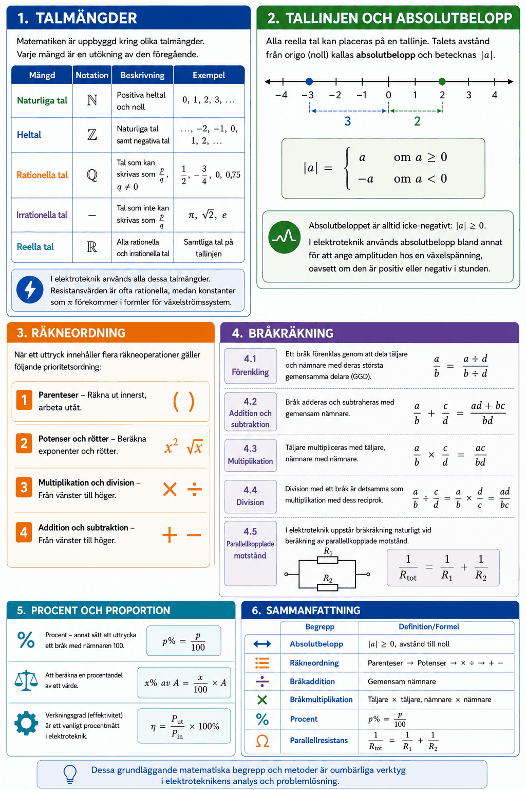
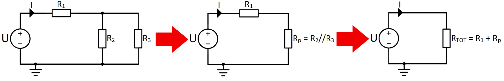

# Appendix A – Talsystem och grundläggande aritmetik



## 1. Talmängder
Matematiken är uppbyggd kring olika talmängder. Varje mängd är en utökning av den föregående.

| Mängd | Notation | Beskrivning | Exempel |
|-------|----------|-------------|---------|
| Naturliga tal | $\mathbb{N}$ | Positiva heltal och noll | $0, 1, 2, 3, \ldots$ |
| Heltal | $\mathbb{Z}$ | Naturliga tal samt negativa tal | $\ldots, -2, -1, 0, 1, 2, \ldots$ |
| Rationella tal | $\mathbb{Q}$ | Tal som kan skrivas som $\frac{p}{q}$, $q \neq 0$ | $\frac{1}{2},\, -\frac{3}{4},\, 0{,}75$ |
| Irrationella tal | – | Tal som *inte* kan skrivas som $\frac{p}{q}$ | $\pi,\, \sqrt{2},\, e$ |
| Reella tal | $\mathbb{R}$ | Alla rationella och irrationella tal | Samtliga tal på tallinjen |

I elektroteknik används alla dessa talmängder. Resistansvärden är ofta rationella ($R = 4{,}7\,\text{k}\Omega$), medan konstanter som $\pi$ förekommer i formler för växelströmssystem.

---

## 2. Tallinjen och absolutbelopp
Alla reella tal kan placeras på en **tallinje**. Talets avstånd från origo (noll) kallas **absolutbelopp** och betecknas $|a|$.

```math
|a| =
\begin{cases}
a & \text{om } a \geq 0 \\
-a & \text{om } a < 0
\end{cases}
```

**Exempel:**

```math
|5| = 5, \qquad |-3| = 3, \qquad |0| = 0
```

Absolutbeloppet är alltid icke-negativt: $|a| \geq 0$.

I elektroteknik används absolutbelopp bland annat för att ange amplituden hos en växelspänning, oavsett om den är positiv eller negativ i stunden.

---

## 3. Räkneordning
När ett uttryck innehåller flera räkneoperationer gäller följande prioritetsordning:
1. **Parenteser** – Räkna ut innerst, arbeta utåt.
2. **Potenser och rötter** – Beräkna exponenter och rötter.
3. **Multiplikation och division** – Från vänster till höger.
4. **Addition och subtraktion** – Från vänster till höger.

**Exempel:**

```math
3 + 2 \times 4^2 - (1 + 5) = 3 + 2 \times 16 - 6 = 3 + 32 - 6 = 29
```

---

## 4. Bråkräkning
### 4.1 Förenkling
Ett bråk förenklas genom att dela täljare och nämnare med deras största gemensamma delare (GGD):

```math
\frac{12}{18} = \frac{12 \div 6}{18 \div 6} = \frac{2}{3}
```

### 4.2 Addition och subtraktion
Bråk adderas och subtraheras med **gemensam nämnare**:

```math
\frac{a}{b} + \frac{c}{d} = \frac{ad + bc}{bd}
```

**Exempel:**

```math
\frac{1}{3} + \frac{1}{4} = \frac{4}{12} + \frac{3}{12} = \frac{7}{12}
```

### 4.3 Multiplikation
Täljare multipliceras med täljare, nämnare med nämnare:

```math
\frac{a}{b} \times \frac{c}{d} = \frac{ac}{bd}
```

**Exempel:**

```math
\frac{2}{3} \times \frac{3}{5} = \frac{6}{15} = \frac{2}{5}
```

### 4.4 Division
Division med ett bråk är detsamma som multiplikation med dess reciprok:

```math
\frac{a}{b} \div \frac{c}{d} = \frac{a}{b} \times \frac{d}{c} = \frac{ad}{bc}
```

**Exempel:**

```math
\frac{3}{4} \div \frac{3}{8} = \frac{3}{4} \times \frac{8}{3} = \frac{24}{12} = 2
```

### 4.5 Parallellkopplade motstånd
I elektroteknik uppstår bråkräkning naturligt vid beräkning av parallellkopplade motstånd. Den totala resistansen $R_{\text{TOT}}$ för två parallellkopplade motstånd $R_1$ och $R_2$ ges av:

```math
\frac{1}{R_{\text{TOT}}} = \frac{1}{R_1} + \frac{1}{R_2}
```

**Exempel:** $R_1 = 6\,\Omega$, $R_2 = 3\,\Omega$:

```math
\frac{1}{R_{\text{TOT}}} = \frac{1}{6} + \frac{1}{3} = \frac{1}{6} + \frac{2}{6} = \frac{3}{6} = \frac{1}{2}
```

```math
R_{\text{TOT}} = 2\,\Omega
```

---

### 4.6 Serie- och parallellkoppling
När flera motstånd sitter i samma krets kan de ersättas av ett enda motstånd, en så kallad **ersättningsresistans**.

**Seriekoppling** – motstånd kopplade efter varandra. Ersättningsresistansen $R_{\text{s}}$ är summan av resistanserna:

```math
R_{\text{s}} = R_1 + R_2
```

**Parallellkoppling** – motstånd kopplade bredvid varandra, skrivs $R_1 // R_2$. Utöver formeln i avsnitt 4.5 kan parallellresistansen $R_{\text{p}}$ av *två* motstånd beräknas med produkt genom summa, vilket ofta går snabbare:

```math
R_{\text{p}} = R_1 // R_2 = \frac{R_1 \times R_2}{R_1 + R_2}
```

Parallellresistansen blir alltid mindre än det minsta av de ingående motstånden.

**Ohms lag** knyter ihop spänning $U$, resistans $R$ och ström $I$:

```math
U = R \times I
\qquad \Leftrightarrow \qquad
I = \frac{U}{R}
\qquad \Leftrightarrow \qquad
R = \frac{U}{I}
```

> **Tips:** Räknas resistansen i $\Omega$ och spänningen i V så fås strömmen direkt i mA. Då slipper man hålla reda på tiopotenser.

**Exempel:** Kretsen nedan förenklas stegvis tills endast ett motstånd återstår. Först ersätts parallellkopplingen av $R_2$ och $R_3$ med $R_{\text{p}}$, därefter adderas $R_1$ till den totala resistansen $R_{\text{TOT}}$.



Med $R_1 = 2\,\text{k}\Omega$, $R_2 = 12\,\text{k}\Omega$, $R_3 = 6\,\text{k}\Omega$ och $U = 12\,\text{V}$:

```math
R_{\text{p}} = \frac{12 \times 6}{12 + 6} = \frac{72}{18} = 4\,\text{k}\Omega
```

```math
R_{\text{TOT}} = R_1 + R_{\text{p}} = 2 + 4 = 6\,\text{k}\Omega
```

```math
I = \frac{U}{R_{\text{TOT}}} = \frac{12}{6} = 2\,\text{mA}
```

Ordningen är avgörande: parallellkopplingen är en egen delberäkning som måste vara klar innan $R_1$ adderas, precis som parenteser beräknas först enligt räkneordningen.

---

## 5. Procent och proportion
**Procent** är ett annat sätt att uttrycka ett bråk med nämnaren 100:

```math
p\% = \frac{p}{100}
```

**Att beräkna en procentandel:**

```math
x\% \text{ av } A = \frac{x}{100} \times A
```

**Exempel:** Hur stor del av $200\,\text{V}$ är $30\%$?

```math
\frac{30}{100} \times 200 = 60\,\text{V}
```

**Verkningsgrad (effektivitet)** är ett vanligt procentmått i elektroteknik:

```math
\eta = \frac{P_{\text{ut}}}{P_{\text{in}}} \times 100\%
```

**Exempel:** En transformator tar in $500\,\text{W}$ och levererar $470\,\text{W}$. Beräkna verkningsgraden:

```math
\eta = \frac{470}{500} \times 100\% = 94\%
```

---

## 6. Sammanfattning

| Begrepp | Definition/Formel |
|---------|-------------------|
| Absolutbelopp | $\|a\| \geq 0$, avstånd till noll |
| Räkneordning | Parenteser → Potenser → $\times\div$ → $+-$ |
| Bråkaddition | Gemensam nämnare |
| Bråkmultiplikation | Täljare $\times$ täljare, nämnare $\times$ nämnare |
| Procent | $p\% = \frac{p}{100}$ |
| Parallellresistans | $\frac{1}{R_{\text{TOT}}} = \frac{1}{R_1} + \frac{1}{R_2}$ |
| Parallellresistans (två motstånd) | $R_{\text{p}} = \frac{R_1 \times R_2}{R_1 + R_2}$ |
| Serieresistans | $R_{\text{s}} = R_1 + R_2$ |
| Ohms lag | $U = R \times I$ |

---
