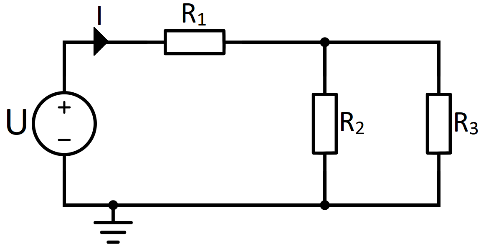

# L01 – Lektionsuppgifter

## Del 1 – Inledande uppgifter
### 1.1 – Beräkningar med räkneordning
Beräkna följande uttryck **utan** miniräknare:\
**a)** $3 + 2 \times 5$


**b)** $(3 + 2) \times 5$


**c)** $12 - 4 \times 2 + 1$


**d)** $\dfrac{10 + 2}{3} \times 4 - 1$

---

### 1.2 – Bråkräkning
Beräkna och förenkla:\
**a)** $\dfrac{1}{4} + \dfrac{1}{6}$


**b)** $\dfrac{3}{5} - \dfrac{1}{4}$


**c)** $\dfrac{2}{3} \times \dfrac{9}{4}$


**d)** $\dfrac{5}{6} \div \dfrac{5}{12}$

---

### 1.3 – Procenträkning
**a)** Beräkna $40\%$ av $250$.\
**b)** Vilket procenttal är $18$ av $72$?\
**c)** En resistor har nominellt värde $100\,\Omega$ med en tolerans på $\pm 5\,\%$. Ange det lägsta och det högsta tillåtna motståndet.

---

## Del 2 – Nytt stoff
### 2.1 – Parallellkopplade motstånd
Två motstånd $R_1 = 12\,\Omega$ och $R_2 = 6\,\Omega$ är parallellkopplade.

Sambandet för den totala resistansen $R_{\text{TOT}}$ ges av:

```math
\frac{1}{R_{\text{TOT}}} = \frac{1}{R_1} + \frac{1}{R_2}
```

**a)** Beräkna $\dfrac{1}{R_{\text{TOT}}}$.\
**b)** Beräkna $R_{\text{TOT}}$.

---

### 2.2 – Serie- och parallellkoppling
Kretsen nedan består av motståndet $R_1$ i serie med parallellkopplingen av $R_2$ och $R_3$.



Komponentvärdena är $R_1 = 4\,\text{k}\Omega$, $R_2 = 24\,\text{k}\Omega$ och $R_3 = 8\,\text{k}\Omega$.

Parallellresistansen $R_{\text{p}} = R_2 // R_3$ kan beräknas på två sätt:

```math
\frac{1}{R_{\text{p}}} = \frac{1}{R_2} + \frac{1}{R_3}
\qquad \text{eller} \qquad
R_{\text{p}} = \frac{R_2 \times R_3}{R_2 + R_3}
```

**a)** Beräkna $R_{\text{p}}$ med båda formlerna och kontrollera att de ger samma svar.\
**b)** Beräkna kretsens totala resistans $R_{\text{TOT}} = R_1 + R_{\text{p}}$.\
**c)** Varför måste parallellkopplingen beräknas innan $R_1$ adderas? Koppla svaret till räkneordningen.

---

### 2.3 – Ström och spänning i kretsen
Kretsen i uppgift 2.2 matas med spänningen $U = 20\,\text{V}$. Ohms lag ger sambandet mellan spänning, resistans och ström:

```math
U = R \times I
```

> **Tips:** Räknar du med resistansen i k$\Omega$ och spänningen i V så får du strömmen direkt i mA.

**a)** Beräkna strömmen $I$ som spänningskällan levererar.\
**b)** Beräkna spänningen $U_1$ över $R_1$.\
**c)** Beräkna spänningen $U_{\text{p}}$ över parallellkopplingen.\
**d)** Beräkna strömmarna $I_2$ och $I_3$ genom $R_2$ respektive $R_3$. Kontrollera att $I_2 + I_3 = I$.

---

### 2.4 – Absolutbelopp
En växelspänning varierar mellan $-8\,\text{V}$ och $+8\,\text{V}$.\
**a)** Vad är amplituden $|U|$ hos spänningen?\
**b)** Vid en viss tidpunkt är spänningen $u(t) = -5{,}3\,\text{V}$. Beräkna $|u(t)|$.

---

### 2.5 – Verkningsgrad
En batteridriven motor tar in $P_{\text{in}} = 24\,\text{W}$ och avger $P_{\text{ut}} = 18\,\text{W}$.

**a)** Beräkna motorns verkningsgrad $\eta$ i procent.\
**b)** Om verkningsgraden förbättras till $90\,\%$ vid samma ineffekt – hur stor blir uteffekten?

---

### 2.6 – Talmängder
Klassificera varje tal i den *minsta* talmängd det tillhör ($\mathbb{N}$, $\mathbb{Z}$, $\mathbb{Q}$, irrationella, $\mathbb{R}$):\
**a)** $7$\
**b)** $-3$\
**c)** $\dfrac{3}{4}$\
**d)** $\sqrt{2}$\
**e)** $0{,}25$\
**f)** $\pi$

---
