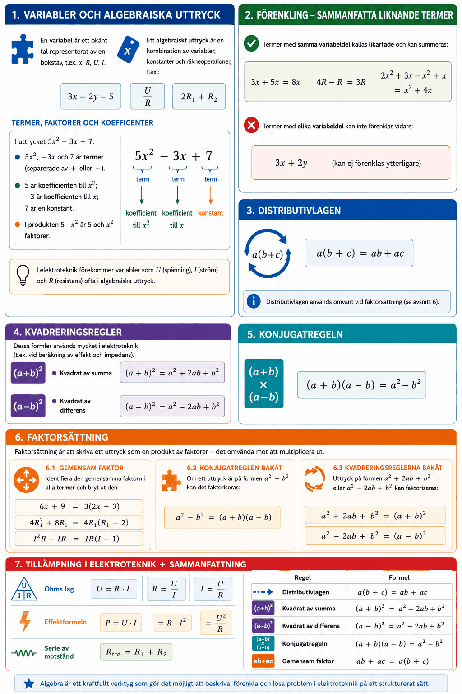

# Appendix A – Algebra



## 1. Variabler och algebraiska uttryck
En **variabel** är ett okänt tal representerat av en bokstav, t.ex. $x$, $R$, $U$, $I$.

Ett **algebraiskt uttryck** är en kombination av variabler, konstanter och räkneoperationer, t.ex.:

```math
3x + 2y - 5, \qquad \frac{U}{R}, \qquad 2R_1 + R_2
```

### Termer, faktorer och koefficienter
I uttrycket $5x^2 - 3x + 7$:
* $5x^2$, $-3x$ och $7$ är **termer** (separerade av $+$ eller $-$).
* $5$ är **koefficienten** till $x^2$; $-3$ är koefficienten till $x$; $7$ är en **konstant**.
* I produkten $5 \cdot x^2$ är $5$ och $x^2$ **faktorer**.

---

## 2. Förenkling – sammanfatta liknande termer
Termer med *samma variabeldel* kallas **likartade** och kan summeras:

```math
3x + 5x = 8x, \qquad 4R - R = 3R, \qquad 2x^2 + 3x - x^2 + x = x^2 + 4x
```

Termer med *olika* variabeldel kan **inte** förenklas vidare:

```math
3x + 2y \quad \text{(kan ej förenklas ytterligare)}
```

---

## 3. Distributivlagen
Distributivlagen används för att multiplicera ut parenteser:

```math
a(b + c) = ab + ac
```

**Exempel:**

```math
3(2x + 4) = 6x + 12
```

```math
-2(R_1 + R_2 - 3) = -2R_1 - 2R_2 + 6
```

Distributivlagen används omvänt vid faktorsättning (se avsnitt 6).

---

## 4. Kvadreringsregler
Dessa formler används mycket i elektroteknik (t.ex. vid beräkning av effekt och impedans).

### Kvadrat av summa

```math
(a + b)^2 = a^2 + 2ab + b^2
```

**Exempel:**

```math
(R + 2)^2 = R^2 + 4R + 4
```

### Kvadrat av differens

```math
(a - b)^2 = a^2 - 2ab + b^2
```

**Exempel:**

```math
(U - 3)^2 = U^2 - 6U + 9
```

---

## 5. Konjugatregeln

```math
(a + b)(a - b) = a^2 - b^2
```

**Exempel:**

```math
(x + 5)(x - 5) = x^2 - 25
```

```math
(2R + 1)(2R - 1) = 4R^2 - 1
```

---

## 6. Faktorsättning
Faktorsättning är att skriva ett uttryck som en **produkt av faktorer** – det omvända mot att multiplicera ut. Det finns flera metoder.

### 6.1 Gemensam faktor
Identifiera den gemensamma faktorn i alla termer och bryt ut den:

```math
6x + 9 = 3(2x + 3)
```

```math
4R_1^2 + 8R_1 = 4R_1(R_1 + 2)
```

```math
I^2 R - IR = IR(I - 1)
```

### 6.2 Konjugatregeln bakåt
Om ett uttryck är på formen $a^2 - b^2$ kan det faktoriseras:

```math
a^2 - b^2 = (a + b)(a - b)
```

**Exempel:**

```math
x^2 - 16 = (x + 4)(x - 4)
```

```math
4U^2 - 9 = (2U + 3)(2U - 3)
```

### 6.3 Kvadreringsreglerna bakåt
Uttryck på formen $a^2 + 2ab + b^2$ eller $a^2 - 2ab + b^2$ kan faktoriseras:

```math
x^2 + 6x + 9 = (x + 3)^2
```

```math
R^2 - 4R + 4 = (R - 2)^2
```

---

## 7. Tillämpning i elektroteknik
**Ohms lag** på algebraisk form:

```math
U = R \cdot I
```

Lagen kan skrivas om beroende på vilken storhet som söks:

```math
R = \frac{U}{I}, \qquad I = \frac{U}{R}
```

**Effektformeln** ger upphov till algebraiska uttryck:

```math
P = U \cdot I = R \cdot I^2 = \frac{U^2}{R}
```

Vid seriekoppling av motstånd $R_1$ och $R_2$ gäller:

```math
R_{\text{tot}} = R_1 + R_2
```

vilket är ett linjärt algebraiskt uttryck.

---

## 8. Sammanfattning

| Regel | Formel |
|-------|--------|
| Distributivlagen | $a(b+c) = ab + ac$ |
| Kvadrat av summa | $(a+b)^2 = a^2 + 2ab + b^2$ |
| Kvadrat av differens | $(a-b)^2 = a^2 - 2ab + b^2$ |
| Konjugatregeln | $(a+b)(a-b) = a^2 - b^2$ |
| Gemensam faktor | $ab + ac = a(b+c)$ |

---
