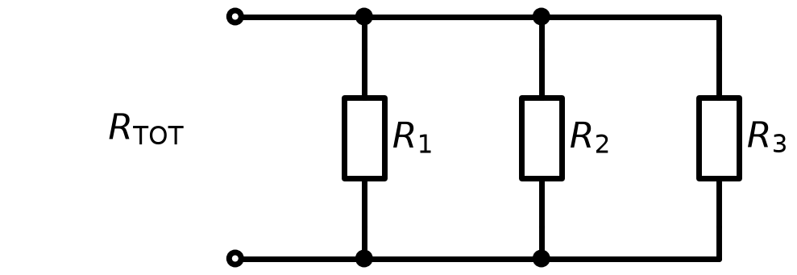
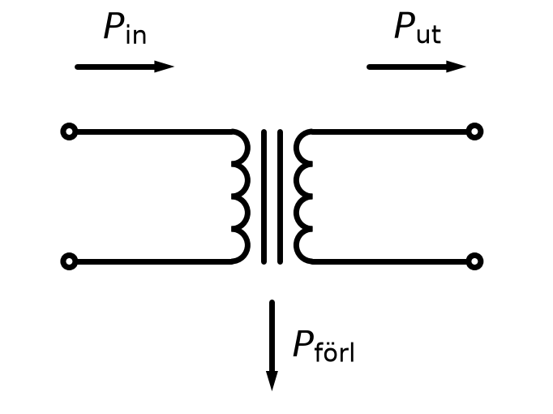
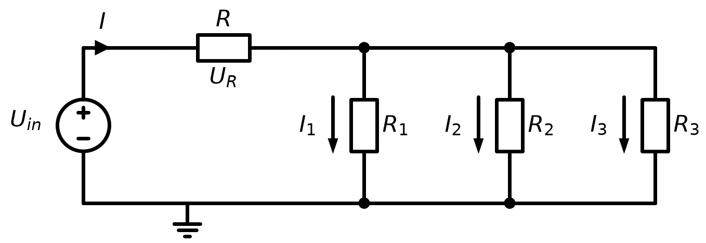
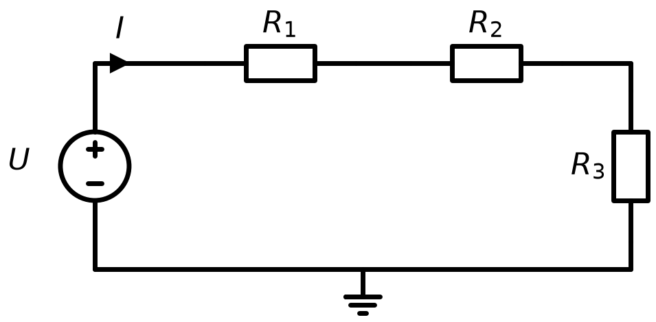
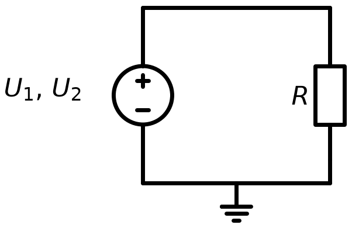
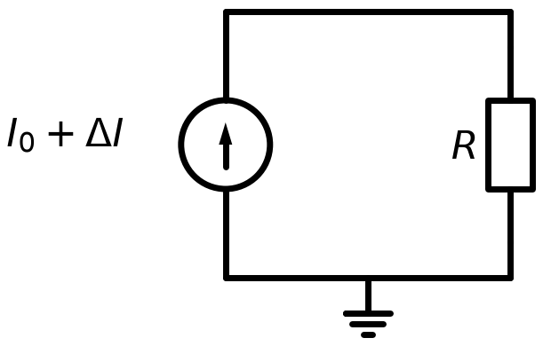
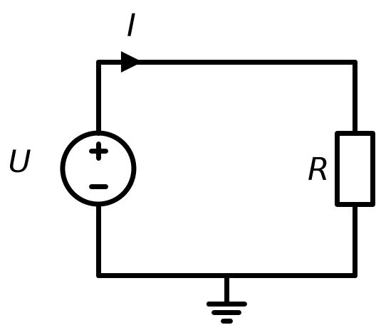

# L02 – Lektionsuppgifter

## Del 1 – Repetitionsuppgifter
### 1.1 – Parallellkoppling av tre motstånd
Tre motstånd $R_1 = 6\thinspace\Omega$, $R_2 = 3\thinspace\Omega$ och $R_3 = 2\thinspace\Omega$ är parallellkopplade.



Den totala resistansen ges av:

```math
\frac{1}{R_{\text{TOT}}} = \frac{1}{R_1} + \frac{1}{R_2} + \frac{1}{R_3}
```

Beräkna $R_{\text{TOT}}$.

---

### 1.2 – Verkningsgrad och effekt
En transformator har verkningsgraden $\eta = 92\thinspace\char37$ och ineffekten $P_{\text{in}} = 500\thinspace\text{W}$.



**a)** Beräkna uteffekten $P_{\text{ut}}$.

**b)** Hur stor effekt $P_{\text{förl}}$ förloras som värme?

---

### 1.3 – Räkneordning i kretsformel


Beräkna spänningsdelarens utspänning $U_{\text{ut}}$ med nedanstående formel då $U_{\text{in}} = 12\thinspace\text{V}$, $R_1 = 8\thinspace\Omega$ och $R_2 = 4\thinspace\Omega$:

```math
U_{\text{ut}} = U_{\text{in}} \times \frac{R_2}{R_1 + R_2}
```

---

## Del 2 – Nytt stoff
### 2.1 – Förenkling av algebraiska uttryck
Förenkla följande uttryck:

**a)** $5I_1 + 3I_2 - 2I_1 + 7I_2$

**b)** $4R_1 - 3R_2 + R_1 + 5R_2 - 2R_1$

**c)** $3I^2 - 2I + 4I^2 + 5I - 1$

**d)** Sätt in $I = 2$ i både det ursprungliga och det förenklade uttrycket i **c)** och kontrollera att de ger samma värde.

---

### 2.2 – Distributivlagen i kretsar
Motståndet $R$ i kretsen nedan genomflyts av summan av de tre grenströmmarna $I_1$, $I_2$ och $I_3$.



Spänningsfallet över $R$ ges därmed av:

```math
U_R = RI = R(I_1 + I_2 + I_3)
```

**a)** Multiplicera ut parentesen och ange varje term med enhet.

**b)** Beräkna $U_R$ med den ursprungliga formen då $R = 100\thinspace\Omega$, $I_1 = 20\thinspace\text{mA}$, $I_2 = 30\thinspace\text{mA}$ och $I_3 = 50\thinspace\text{mA}$.

**c)** Beräkna $U_R$ en gång till med det utmultiplicerade uttrycket och kontrollera att svaren stämmer överens.

---

### 2.3 – Faktorisering
Faktorisera följande uttryck:

**a)** $6I + 9RI$

**b)** $P_1^2 - P_2^2$

**c)** $U^2 - 10U + 25$

**d)** $4R^2 - 1$

---

### 2.4 – Gemensam faktor: total effekt i en seriekrets
Tre motstånd $R_1 = 120\thinspace\Omega$, $R_2 = 180\thinspace\Omega$ och $R_3 = 200\thinspace\Omega$ är seriekopplade och genomflyts därmed av samma ström $I = 50\thinspace\text{mA}$.



Effekten i respektive motstånd ges av $P_k = R_k I^2$.

**a)** Skriv ett uttryck för den totala effekten $P_{\text{TOT}} = P_1 + P_2 + P_3$ och bryt ut den gemensamma faktorn.

**b)** Beräkna $P_{\text{TOT}}$ med det faktoriserade uttrycket.

**c)** Beräkna $P_1$, $P_2$ och $P_3$ var för sig och kontrollera att summan blir densamma. Vilken väg krävde minst räknearbete?

---

### 2.5 – Konjugatregeln: skillnad i effekt
Ett värmeelement med resistansen $R$ matas först med spänningen $U_1$ och sedan med $U_2$.



Effekten ges av $P = \dfrac{U^2}{R}$.

**a)** Visa att effektskillnaden kan skrivas:

```math
P_1 - P_2 = \frac{(U_1 + U_2)(U_1 - U_2)}{R}
```

**b)** Beräkna $P_1 - P_2$ **utan** miniräknare då $U_1 = 24\thinspace\text{V}$, $U_2 = 20\thinspace\text{V}$ och $R = 8\thinspace\Omega$.

**c)** Kontrollera svaret genom att beräkna $P_1$ och $P_2$ var för sig.

---

### 2.6 – Kvadreringsregeln: effekt vid en strömändring
Genom ett motstånd $R = 10\thinspace\Omega$ flyter strömmen $I_0 = 2\thinspace\text{A}$. Strömmen ökar med $\Delta I = 0{,}1\thinspace\text{A}$, så att den nya strömmen blir $I_0 + \Delta I$.



Effekten ges av $P = RI^2$.

**a)** Multiplicera ut $P = R(I_0 + \Delta I)^2$ med kvadreringsregeln.

**b)** Beräkna den nya effekten med det utmultiplicerade uttrycket.

**c)** Hur stor är effektökningen $\Delta P$ jämfört med $P_0 = RI_0^2$?

**d)** Hur stort blir felet om man struntar i termen $R\thinspace\Delta I^2$? Ange felet i procent av $\Delta P$.

---

### 2.7 – Effektuttryck och Ohms lag
Effekten som utvecklas i motståndet nedan kan skrivas $P = RI^2$.



**a)** Visa att $P = RI^2$ kan faktoriseras till $P = (RI) \cdot I$ och identifiera vilken storhet $RI$ representerar.

**b)** Sätt in $I = \dfrac{U}{R}$ i $P = RI^2$ och visa att uttrycket kan förenklas till $P = \dfrac{U^2}{R}$.

**c)** Ett motstånd $R = 6\thinspace\Omega$ matas med $U = 12\thinspace\text{V}$. Beräkna effekten med alla tre formerna $P = UI$, $P = RI^2$ och $P = \dfrac{U^2}{R}$ och kontrollera att de ger samma svar.

---

## Del 3 – Extrauppgifter
Uppgifterna nedan är extra träning och görs med fördel på egen hand efter lektionen. De flesta går att räkna i huvudet eller med papper och penna.

### 3.1 – Termer, faktorer och koefficienter
Betrakta uttrycket $7R^2 - 4R + 9$.

**a)** Hur många termer består uttrycket av?

**b)** Ange koefficienten till $R^2$ respektive till $R$.

**c)** Ange konstanttermen.

**d)** Vilka faktorer ingår i termen $7R^2$?

**e)** Beräkna uttryckets värde för $R = 2$.

---

### 3.2 – Förenkling med parenteser
Förenkla:

**a)** $2(3I + 4) - 3(I - 2)$

**b)** $-(U - 5) + 2(U + 1)$

**c)** $5R_1 - \left[2R_1 - (R_1 + 3)\right]$

**d)** $3(2P - 1) - 2(3P - 4)$

---

### 3.3 – Multiplicera ut
Multiplicera ut och förenkla:

**a)** $(R + 3)(R + 5)$

**b)** $(2I - 1)(I + 4)$

**c)** $(U + 2)(U - 2)$

**d)** $(3R - 2)(3R - 2)$

**e)** $2I(I + 3) - I(2I - 1)$

---

### 3.4 – Kvadreringsreglerna
Utveckla:

**a)** $(I + 4)^2$

**b)** $(R - 6)^2$

**c)** $(2U + 3)^2$

**d)** $(5 - I)^2$

**e)** Visa med $a = 3$ och $b = 4$ att $(a + b)^2 \neq a^2 + b^2$.

---

### 3.5 – Konjugatregeln som huvudräkningstrick
Använd $(a + b)(a - b) = a^2 - b^2$ och räkna **utan** miniräknare:

**a)** $102 \times 98$

**b)** $45 \times 35$

**c)** $2{,}1 \times 1{,}9$

**d)** $51^2 - 49^2$

**e)** Spänningen över ett motstånd $R = 5\thinspace\Omega$ ändras från $U_1 = 25\thinspace\text{V}$ till $U_2 = 15\thinspace\text{V}$. Beräkna $P_1 - P_2 = \dfrac{U_1^2 - U_2^2}{R}$ utan att kvadrera något tal.

---

### 3.6 – Faktorisera
Faktorisera så långt som möjligt:

**a)** $8R + 12$

**b)** $RI^2 + RI$

**c)** $U^2 - 49$

**d)** $I^2 + 12I + 36$

**e)** $9R^2 - 16$

**f)** $2U^2 - 8$

---

### 3.7 – Förkorta algebraiska bråk
Faktorisera och förkorta. Antag att nämnaren inte är noll.

**a)** $\dfrac{6RI}{3R}$

**b)** $\dfrac{R^2 - 9}{R + 3}$

**c)** $\dfrac{2U^2 + 4U}{2U}$

**d)** $\dfrac{I^2 - 10I + 25}{I - 5}$

**e)** $\dfrac{4R^2 - 1}{2R - 1}$

---

### 3.8 – Insättning i effektformlerna
Ett motstånd $R = 8\thinspace\Omega$ genomflyts av strömmen $I = 1{,}5\thinspace\text{A}$.

**a)** Beräkna spänningen $U = RI$.

**b)** Beräkna effekten med $P = RI^2$.

**c)** Beräkna effekten med $P = \dfrac{U^2}{R}$ och kontrollera att svaret stämmer.

**d)** Strömmen fördubblas. Med vilken faktor ändras effekten? Motivera algebraiskt.

---

### 3.9 – Spänningsdelarens algebra
För två seriekopplade motstånd gäller:

```math
U_1 = U_{\text{in}} \times \frac{R_1}{R_1 + R_2}
\qquad \text{och} \qquad
U_2 = U_{\text{in}} \times \frac{R_2}{R_1 + R_2}
```

**a)** Visa algebraiskt att $U_1 + U_2 = U_{\text{in}}$.

**b)** Visa att $\dfrac{U_1}{U_2} = \dfrac{R_1}{R_2}$.

**c)** Vad blir $U_1$ om $R_1 = R_2$?

**d)** Beräkna $U_1$ och $U_2$ då $U_{\text{in}} = 15\thinspace\text{V}$, $R_1 = 1\thinspace\text{k}\Omega$ och $R_2 = 4\thinspace\text{k}\Omega$.

---

### 3.10 – Hitta felet
Varje rad nedan innehåller ett vanligt algebrafel. Förklara vad som är fel och skriv det korrekta högerledet.

**a)** $(R + 2)^2 = R^2 + 4$

**b)** $3(I - 2) = 3I - 2$

**c)** $\dfrac{R + 4}{4} = R$

**d)** $-(U - 3) = -U - 3$

**e)** $2R \times 3R = 6R$

**f)** $(2I)^2 = 2I^2$

---
