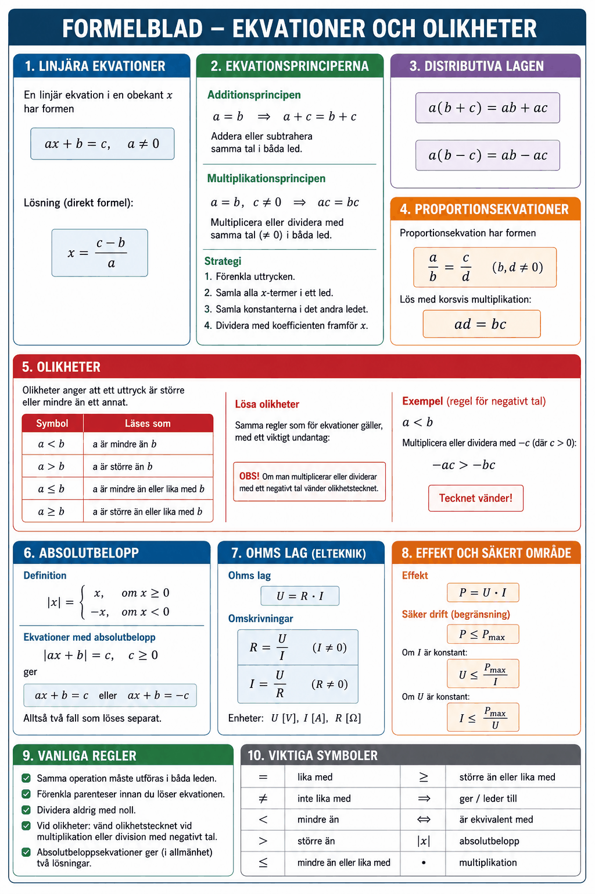

# Appendix A – Linjära ekvationer och olikheter



## 1. Ekvationer
En **ekvation** är ett påstående om att två uttryck är lika:

```math
\text{vänsterled} = \text{högerled}
```

En **linjär ekvation** i en obekant $x$ är en ekvation där $x$ förekommer med högst potensen 1:

```math
ax + b = c, \quad a \neq 0
```

**Lösa en ekvation** innebär att bestämma vilket/vilka värden på $x$ som uppfyller ekvationen.

---

## 2. Ekvationsprinciperna
En ekvations lösning förändras inte om man utför *samma* operation på båda led.

| Princip | Beskrivning |
|---------|-------------|
| **Additionsprincipen** | Addera eller subtrahera samma tal i båda led |
| **Multiplikationsprincipen** | Multiplicera eller dividera med samma tal (≠ 0) i båda led |

**Strategi:** Flytta alla termer med obekant till ett led, konstanter till det andra.

---

## 3. Lösa linjära ekvationer – steg för steg
**Exempel 1:** Lös $3x - 5 = 7$.

```math
3x - 5 = 7
```

Addera $5$ i båda led:

```math
3x = 12
```

Dividera med $3$ i båda led:

```math
x = 4
```

**Kontroll:** $3 \cdot 4 - 5 = 12 - 5 = 7$ ✓

---

**Exempel 2 (elteknisk kontext):** En krets har spänningen $U = 12\,\text{V}$ och strömmen $I = 0{,}5\,\text{A}$. Beräkna motståndet $R$.

Ohms lag ger:

```math
U = R \cdot I \quad \Leftrightarrow \quad 12 = R \cdot 0{,}5
```

Dividera med $0{,}5$:

```math
R = \frac{12}{0{,}5} = 24\,\Omega
```

---

**Exempel 3 (med parenteser):** Lös $2(3x + 1) = 14$.

Multiplicera ut parentesen:

```math
6x + 2 = 14
```

Subtrahera $2$:

```math
6x = 12
```

Dividera med $6$:

```math
x = 2
```

---

## 4. Proportionsekvationer
En proportionsekvation har formen:

```math
\frac{a}{b} = \frac{c}{d}
```

Lös genom **korsvis multiplikation** (multiplicera diagonalt):

```math
ad = bc
```

**Exempel:** Lös $\dfrac{x}{6} = \dfrac{4}{3}$:

```math
3x = 24 \quad \Rightarrow \quad x = 8
```

---

## 5. Olikheter
En **olikhet** anger att ett uttryck är större eller mindre än ett annat:

| Symbol | Läses som |
|--------|-----------|
| $a < b$ | $a$ är mindre än $b$ |
| $a > b$ | $a$ är större än $b$ |
| $a \leq b$ | $a$ är mindre än eller lika med $b$ |
| $a \geq b$ | $a$ är större än eller lika med $b$ |

### 5.1 Lösa olikheter
Olikheter löses precis som ekvationer med ett viktigt undantag:

> **OBS!** Om man multiplicerar eller dividerar med ett **negativt tal** vänder olikhetstecknet.

**Exempel 1:** Lös $2x + 3 > 9$.

```math
2x > 6 \quad \Rightarrow \quad x > 3
```

Lösningen är alla $x$ som är större än $3$, dvs. $x \in (3, \infty)$.

**Exempel 2 (negativt tal):** Lös $-3x \leq 12$.

Dividera med $-3$ – tecknet vänder:

```math
x \geq -4
```

### 5.2 Praktisk tillämpning – säkert driftområde
En komponent tål maximalt $P_{\max} = 2\,\text{W}$ och effekten ges av $P = U \cdot I$ med $I = 0{,}5\,\text{A}$. Bestäm det tillåtna spänningsintervallet:

```math
U \cdot 0{,}5 \leq 2 \quad \Rightarrow \quad U \leq 4\,\text{V}
```

Spänningen måste hållas under $4\,\text{V}$ för att komponenten inte ska skadas.

---

## 6. Absolutbelopp i ekvationer
Ekvationer med absolutbelopp har (i allmänhet) två möjliga lösningar.

$|ax + b| = c$ (med $c \geq 0$) ger:

```math
ax + b = c \quad \text{eller} \quad ax + b = -c
```

**Exempel:** Lös $|2x - 3| = 5$.

Fall 1: $2x - 3 = 5 \Rightarrow x = 4$

Fall 2: $2x - 3 = -5 \Rightarrow x = -1$

**Lösning:** $x = 4$ eller $x = -1$.

---

## 7. Sammanfattning

| Begrepp | Nyckelregel |
|---------|-------------|
| Linjär ekvation | Isolera obekant via additions- och multiplikationsprincipen |
| Proportionsekvation | Korsvis multiplikation: $\frac{a}{b} = \frac{c}{d} \Rightarrow ad = bc$ |
| Olikhet | Samma regler som ekvation, MEN tecknet vänder vid multiplikation/division med negativt tal |
| Absolutbelopp | $\|ax+b\| = c \Rightarrow$ två fall: $ax+b=c$ eller $ax+b=-c$ |

---
