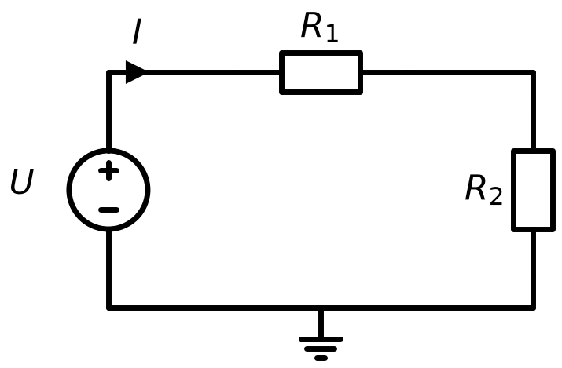
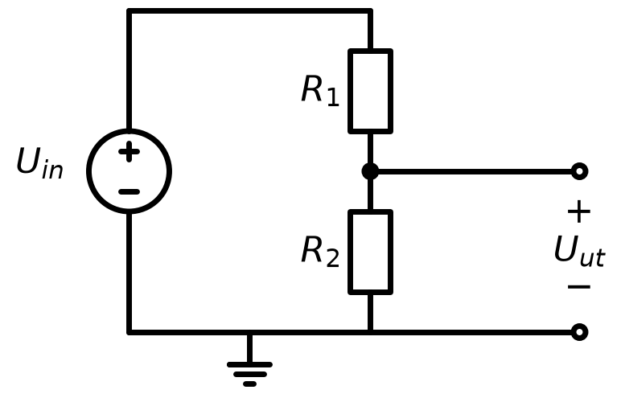
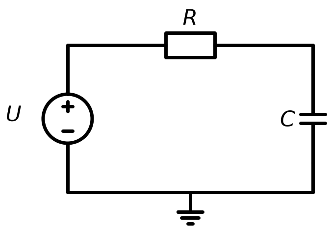
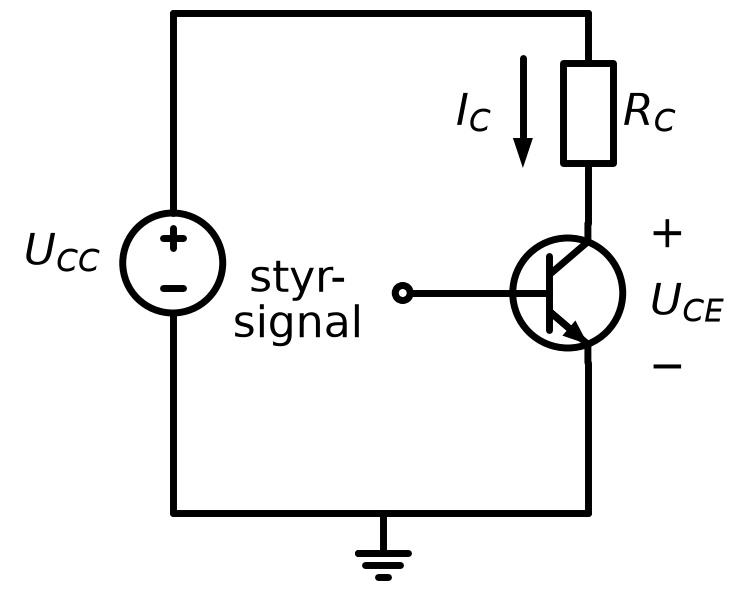
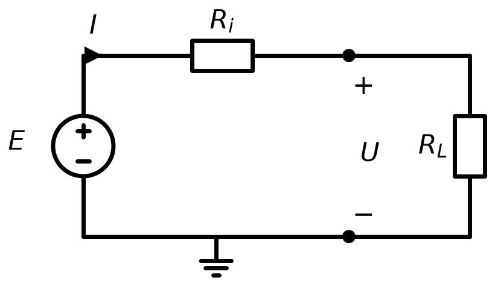

# L03 – Lektionsuppgifter

## Del 1 – Repetitionsuppgifter
### 1.1 – Förenkling
Förenkla följande uttryck:

**a)** $3(2R + 4) - 2(R - 1)$

**b)** $(U + 3)^2 - 9$

**c)** $\dfrac{6I^2 + 4I}{2I}$, antag $I \neq 0$

---

### 1.2 – Faktorisering
Faktorisera:

**a)** $R^2 - 25$

**b)** $3U^2 + 6U$

**c)** $I^2 - 8I + 16$

---

## Del 2 – Nytt stoff
### 2.1 – Ohms lag – sök motståndet
Spänningen över ett motstånd är $U = 15\thinspace\text{V}$ och strömmen är $I = 0{,}3\thinspace\text{A}$.


Ohms lag anger att $U = R \cdot I$.

**a)** Sätt upp ekvationen och lös för $R$.

**b)** Kontrollera svaret.

---

### 2.2 – Seriekrets – ekvation med parentes
Två motstånd är seriekopplade. Kretsen matas med $U = 24\thinspace\text{V}$ och strömmen är $I = 0{,}4\thinspace\text{A}$. Det ena motståndet är $R_2 = 40\thinspace\Omega$, det andra är okänt.



Ohms lag för hela kretsen ger:

```math
U = (R_1 + R_2) \cdot I
```

**a)** Sätt in värdena och lös ekvationen för $R_1$ **utan** att multiplicera ut parentesen.

**b)** Lös ekvationen en gång till, men multiplicera ut parentesen först. Kontrollera att du får samma svar.

**c)** Kontrollera lösningen genom att beräkna strömmen $I = \dfrac{U}{R_1 + R_2}$.

---

### 2.3 – Spänningsdelning
I en spänningsdelare ges utspänningen av:

```math
U_{\text{ut}} = \frac{R_2}{R_1 + R_2} \cdot U_{\text{in}}
```



Antag $U_{\text{in}} = 9\thinspace\text{V}$, $R_2 = 3\thinspace\Omega$ och $U_{\text{ut}} = 3\thinspace\text{V}$.

**a)** Sätt upp ekvationen för $U_{\text{ut}}$ och lös för $R_1$.

**b)** Kontrollera svaret.

---

### 2.4 – Tidskonstant i RC-krets
Laddningstiden $\tau$ (tau) i en RC-krets är:

```math
\tau = R \cdot C
```



Kondensatorns kapacitans är $C = 100\thinspace\mu\text{F} = 100 \times 10^{-6}\thinspace\text{F}$ och tidskonstanten $\tau = 0{,}05\thinspace\text{s}$.

Beräkna motståndet $R$.

---

### 2.5 – Säkert driftområde
En transistors effektdissipation beräknas som $P = U_{CE} \cdot I_C$.



Transistorn tål maximalt $P_{\max} = 500\thinspace\text{mW}$ och kollektorströmmen är $I_C = 50\thinspace\text{mA}$.

**a)** Sätt upp en olikhet för att bestämma det maximalt tillåtna spänningsfallet $U_{CE}$.

**b)** Lös olikheten och ange det maximalt tillåtna $U_{CE}$ i volt.

---

### 2.6 – Belastat batteri – olikhet med teckenvändning
Ett batteri har tomgångsspänningen $E = 12\thinspace\text{V}$ och den inre resistansen $R_i = 0{,}8\thinspace\Omega$. När batteriet belastas med strömmen $I$ blir klämspänningen:

```math
U = E - R_i \cdot I
```



**a)** Beräkna klämspänningen $U$ då $I = 2\thinspace\text{A}$.

**b)** Den anslutna enheten kräver minst $9\thinspace\text{V}$ för att fungera. Sätt upp olikheten $U \geq 9$ och lös den för $I$.

> **Tips:** Tänk på vad som händer med olikhetstecknet när du dividerar med ett negativt tal.

**c)** Ett annat batteri har $E = 13\thinspace\text{V}$ och $R_i = 1{,}0\thinspace\Omega$. Vid vilken ström ger de båda batterierna samma klämspänning? Ställ upp en ekvation med obekant i båda led och lös den.

**d)** Vilket av batterierna ger högst klämspänning vid $I = 8\thinspace\text{A}$?

---

### 2.7 – Absolutbelopp i signalanalys
En signal kan ha positiv eller negativ avvikelse från en referensspänning. Avvikelsen $\delta$ uppfyller $|\delta| \leq 0{,}5\thinspace\text{V}$.

**a)** Skriv om absolutbeloppsolikheten som ett dubbelsidat intervall utan absolutbelopp.

**b)** Om referensspänningen är $5\thinspace\text{V}$, ange det tillåtna intervallet för den faktiska spänningen.

---

### 2.8 – Strömreglering – absolutbeloppsekvation
En strömregulator jämför den uppmätta strömmen $I$ (i ampere) med sitt börvärde och ger felspänningen:

```math
u_e = 0{,}4I - 2
```

**a)** Vid vilken ström är felspänningen noll, dvs. vilket är börvärdet?

**b)** Regulatorn larmar när felspänningen har beloppet $1{,}2\thinspace\text{V}$. Lös ekvationen $|0{,}4I - 2| = 1{,}2$ som två fall och ange de två strömmar där larmet triggar.

**c)** Vilket strömintervall uppfyller $|0{,}4I - 2| \leq 1{,}2$, dvs. när larmar regulatorn *inte*?

---
