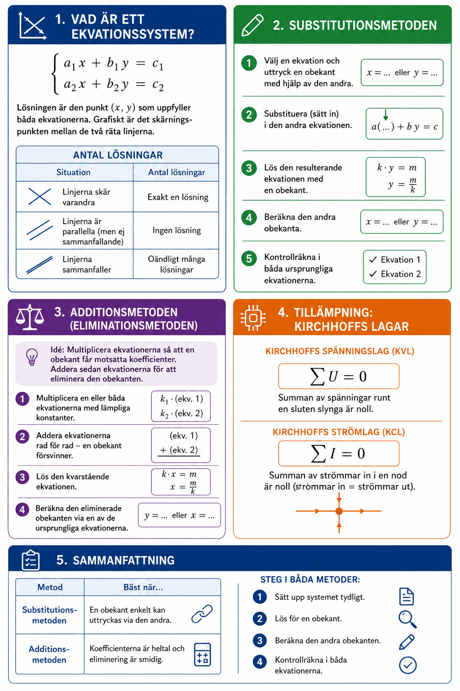

# Appendix A – Ekvationssystem



## 1. Vad är ett ekvationssystem?
Ett **linjärt ekvationssystem** består av flera ekvationer med flera obekanta som ska uppfyllas *samtidigt*. Det vanligaste är ett system med **två ekvationer och två obekanta**:

```math
\begin{cases}
a_1 x + b_1 y = c_1 \\
a_2 x + b_2 y = c_2
\end{cases}
```

**Lösningen** är det par $(x, y)$ som uppfyller båda ekvationerna. Grafiskt är det **skärningspunkten** mellan de två räta linjerna.

### Antal lösningar

| Situation | Antal lösningar |
|-----------|----------------|
| Linjerna skär varandra | Exakt en lösning |
| Linjerna är parallella (men ej sammanfallande) | Ingen lösning |
| Linjerna sammanfaller | Oändligt många lösningar |

---

## 2. Substitutionsmetoden
**Steg:**
1. Välj en ekvation och uttryck en obekant med hjälp av den andra.
2. Substituera (sätt in) i den andra ekvationen.
3. Lös den resulterande ekvationen med en obekant.
4. Beräkna den andra obekanta.
5. Kontrollräkna i *båda* ursprungliga ekvationerna.

**Exempel:** Lös systemet:

```math
\begin{cases}
x + 2y = 7 \\
3x - y = 7
\end{cases}
```

**Steg 1:** Ur ekvation (1): $x = 7 - 2y$

**Steg 2:** Sätt in i ekvation (2):

```math
3(7 - 2y) - y = 7
```

**Steg 3:** Förenkla och lös:

```math
21 - 6y - y = 7 \quad \Rightarrow \quad 21 - 7y = 7 \quad \Rightarrow \quad y = 2
```

**Steg 4:** Beräkna $x$:

```math
x = 7 - 2 \cdot 2 = 3
```

**Steg 5:** Kontroll: $3 + 4 = 7$ ✓ och $9 - 2 = 7$ ✓

**Lösning:** $(x, y) = (3, 2)$.

---

## 3. Additionsmetoden (eliminationsmetoden)
**Idé:** Multiplicera ekvationerna med lämpliga tal så att en obekant får *lika stora men motsatta* koefficienter, addera sedan ekvationerna för att eliminera den obekanten.

**Steg:**
1. Multiplicera en eller båda ekvationerna med lämpliga konstanter.
2. Addera ekvationerna rad för rad – en obekant försvinner.
3. Lös den kvarstående ekvationen.
4. Beräkna den eliminerade obekanten via en av de ursprungliga ekvationerna.

**Exempel:** Lös systemet:

```math
\begin{cases}
2x + 3y = 12 \\
4x - y = 10
\end{cases}
```

**Steg 1:** Multiplicera ekvation (2) med $3$:

```math
\begin{cases}
2x + 3y = 12 \\
12x - 3y = 30
\end{cases}
```

**Steg 2:** Addera ekvationerna:

```math
14x = 42 \quad \Rightarrow \quad x = 3
```

**Steg 3:** Sätt $x = 3$ i ekvation (1):

```math
6 + 3y = 12 \quad \Rightarrow \quad y = 2
```

**Lösning:** $(x, y) = (3, 2)$.

---

## 4. Tillämpning: Kirchhoffs lagar
Ekvationssystem är grundläggande för kretsteori. Med Kirchhoffs lagar kan ström- och spänningsfördelningen i en krets beräknas.

### Kirchhoffs spänningslag (KVL)
> Summan av alla spänningar runt en sluten slynga är noll:

```math
\sum U = 0
```

### Kirchhoffs strömlag (KCL)
> Summan av strömmar in i en nod är noll (strömmar in = strömmar ut):

```math
\sum I = 0
```

**Exempel:** Betrakta en krets med två loopar och strömmarna $I_1$ och $I_2$.

KVL ger:

```math
\begin{cases}
10 = 2I_1 + 4(I_1 - I_2) \\
0 = 4(I_2 - I_1) + 6I_2
\end{cases}
```

Förenklas till:

```math
\begin{cases}
6I_1 - 4I_2 = 10 \\
-4I_1 + 10I_2 = 0
\end{cases}
```

Ur ekvation (2): $I_1 = 2{,}5 I_2$. Sätt in i ekvation (1):

```math
6 \cdot 2{,}5 I_2 - 4I_2 = 10 \quad \Rightarrow \quad I_2 = \frac{10}{11} \approx 0{,}91\,\text{A}
```

```math
I_1 = 2{,}5 \cdot \frac{10}{11} = \frac{25}{11} \approx 2{,}27\,\text{A}
```

---

## 5. Sammanfattning

| Metod | Bäst när... |
|-------|-------------|
| Substitutionsmetoden | En obekant enkelt kan uttryckas via den andra |
| Additionsmetoden | Koefficienterna är heltal och eliminering är smidig |

**Steg i båda metoder:**
1. Sätt upp systemet tydligt.
2. Lös för en obekant.
3. Beräkna den andra obekanten.
4. Kontrollräkna i *båda* ekvationerna.

---
