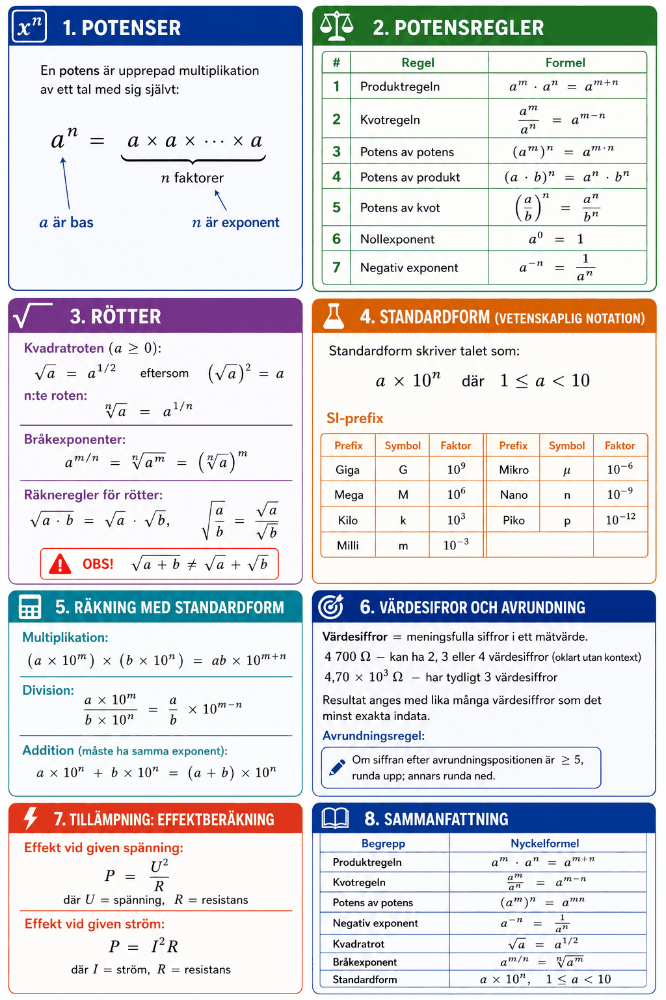

# Appendix A – Potenser och rötter



## 1. Potenser
En **potens** är upprepad multiplikation av ett tal med sig självt:

```math
a^n = \underbrace{a \times a \times \cdots \times a}_{n \text{ faktorer}}
```

Här kallas $a$ **bas** och $n$ **exponent**.

**Exempel:**

```math
2^4 = 2 \times 2 \times 2 \times 2 = 16, \qquad 10^3 = 1\,000
```

---

## 2. Potensregler
Följande sju regler gäller för alla $a \neq 0$ och $b \neq 0$.

| # | Regel | Formel |
|---|-------|--------|
| 1 | Produktregeln | $a^m \cdot a^n = a^{m+n}$ |
| 2 | Kvotregeln | $\dfrac{a^m}{a^n} = a^{m-n}$ |
| 3 | Potens av potens | $(a^m)^n = a^{m \cdot n}$ |
| 4 | Potens av produkt | $(a \cdot b)^n = a^n \cdot b^n$ |
| 5 | Potens av kvot | $\left(\dfrac{a}{b}\right)^n = \dfrac{a^n}{b^n}$ |
| 6 | Nollexponent | $a^0 = 1$ |
| 7 | Negativ exponent | $a^{-n} = \dfrac{1}{a^n}$ |

**Exempel på regel 1:**

```math
10^3 \cdot 10^4 = 10^{3+4} = 10^7
```

**Exempel på regel 7:**

```math
10^{-3} = \frac{1}{10^3} = \frac{1}{1000} = 0{,}001
```

---

## 3. Rötter
**Kvadratroten** av $a$ ($a \geq 0$) är det icke-negativa tal vars kvadrat är $a$:

```math
\sqrt{a} = a^{1/2} \quad \text{eftersom} \quad \left(\sqrt{a}\right)^2 = a
```

**n:te roten** av $a$ är det tal vars n:te potens är $a$:

```math
\sqrt[n]{a} = a^{1/n}
```

### Bråkexponenter
Rötter och potenser kombineras via bråkexponenter:

```math
a^{m/n} = \sqrt[n]{a^m} = \left(\sqrt[n]{a}\right)^m
```

**Exempel:**

```math
8^{2/3} = \left(\sqrt[3]{8}\right)^2 = 2^2 = 4
```

### Räkneregler för rötter

```math
\sqrt{a \cdot b} = \sqrt{a} \cdot \sqrt{b}, \qquad \sqrt{\frac{a}{b}} = \frac{\sqrt{a}}{\sqrt{b}}
```

**OBS!** $\sqrt{a + b} \neq \sqrt{a} + \sqrt{b}$ – detta är ett vanligt misstag!

---

## 4. Standardform (vetenskaplig notation)
I elektroteknik förekommer extremt stora och extremt små tal: $R = 1\,000\,000\,\Omega$, $C = 0{,}000\,000\,001\,\text{F}$.

**Standardform** skriver talet som $a \times 10^n$ där $1 \leq a < 10$:

```math
1\,000\,000 = 1{,}0 \times 10^6, \qquad 0{,}000\,000\,001 = 1{,}0 \times 10^{-9}
```

### SI-prefix

| Prefix | Symbol | Faktor |
|--------|--------|--------|
| Giga | G | $10^9$ |
| Mega | M | $10^6$ |
| Kilo | k | $10^3$ |
| Milli | m | $10^{-3}$ |
| Mikro | μ | $10^{-6}$ |
| Nano | n | $10^{-9}$ |
| Piko | p | $10^{-12}$ |

**Exempel:** $4{,}7\,\text{k}\Omega = 4{,}7 \times 10^3\,\Omega = 4\,700\,\Omega$

**Exempel:** $33\,\text{nF} = 33 \times 10^{-9}\,\text{F} = 3{,}3 \times 10^{-8}\,\text{F}$

---

## 5. Räkning med standardform
**Multiplikation:**

```math
(3 \times 10^4) \times (2 \times 10^3) = 6 \times 10^7
```

**Division:**

```math
\frac{6 \times 10^6}{2 \times 10^2} = 3 \times 10^4
```

**Addition** (måste ha samma exponent):

```math
3{,}5 \times 10^3 + 2{,}0 \times 10^3 = 5{,}5 \times 10^3
```

---

## 6. Värdesiffror och avrundning
**Värdesiffror** är de siffror som bär meningsfull information i ett mätvärde.
* $4\,700\,\Omega$ – kan ha 2, 3 eller 4 värdesiffror (oklart utan kontext)
* $4{,}70 \times 10^3\,\Omega$ – har tydligt **3 värdesiffror**

Resultatet av en beräkning bör normalt anges med lika många värdesiffror som det minst exakta indata.

**Avrundningsregel:** Om siffran efter avrundningspositionen är $\geq 5$, runda upp; annars runda ned.

---

## 7. Tillämpning: Effektberäkning
Effekten dissiperad i ett motstånd $R$ vid spänningen $U$:

```math
P = \frac{U^2}{R}
```

**Exempel:** $U = 6\,\text{V}$, $R = 50\,\Omega$:

```math
P = \frac{6^2}{50} = \frac{36}{50} = 0{,}72\,\text{W}
```

**Effekten vid given ström:**

```math
P = I^2 R
```

**Exempel:** $I = 20\,\text{mA} = 20 \times 10^{-3}\,\text{A}$, $R = 1\,\text{k}\Omega = 10^3\,\Omega$:

```math
P = (20 \times 10^{-3})^2 \times 10^3 = 400 \times 10^{-6} \times 10^3 = 0{,}4\,\text{W}
```

---

## 8. Sammanfattning

| Begrepp | Nyckelformel |
|---------|-------------|
| Produktregeln | $a^m \cdot a^n = a^{m+n}$ |
| Kvotregeln | $a^m / a^n = a^{m-n}$ |
| Potens av potens | $(a^m)^n = a^{mn}$ |
| Negativ exponent | $a^{-n} = 1/a^n$ |
| Kvadratrot | $\sqrt{a} = a^{1/2}$ |
| Bråkexponent | $a^{m/n} = \sqrt[n]{a^m}$ |
| Standardform | $a \times 10^n$, $1 \leq a < 10$ |

---
