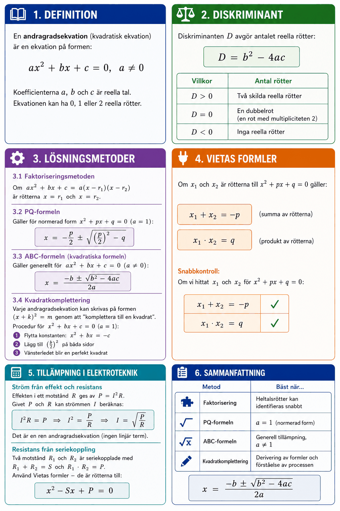

# Appendix A – Andragradsekvationer



## 1. Definition
En **andragradsekvation** (kvadratisk ekvation) är en ekvation på formen:

```math
ax^2 + bx + c = 0, \quad a \neq 0
```

Koefficienterna $a$, $b$ och $c$ är reella tal. Ekvationen kan ha **0, 1 eller 2 reella rötter**.

**Exempel:** $2x^2 - 3x - 5 = 0$ är en andragradsekvation med $a=2$, $b=-3$, $c=-5$.

---

## 2. Diskriminant
**Diskriminanten** $D$ avgör antalet reella rötter:

```math
D = b^2 - 4ac
```

| Villkor | Antal rötter |
|---------|-------------|
| $D > 0$ | Två skilda reella rötter |
| $D = 0$ | En dubbelrot (en rot med multipliciteten 2) |
| $D < 0$ | Inga reella rötter |

---

## 3. Lösningsmetoder
### 3.1 Faktoriseringsmetoden
Om $ax^2 + bx + c$ kan faktoriseras till $a(x - r_1)(x - r_2)$ är rötterna $x = r_1$ och $x = r_2$.

**Exempel:** Lös $x^2 - 5x + 6 = 0$.

Faktorisera: $(x-2)(x-3) = 0$

Rötterna ges av: $x - 2 = 0$ eller $x - 3 = 0$

```math
x_1 = 2, \quad x_2 = 3
```

**Exempel (konjugatregeln):** Lös $x^2 - 9 = 0$.

```math
(x+3)(x-3) = 0 \quad \Rightarrow \quad x = -3 \text{ eller } x = 3
```

### 3.2 PQ-formeln
Gäller för ekvationer på *normerad* form $x^2 + px + q = 0$ (dvs. $a = 1$):

```math
x = -\frac{p}{2} \pm \sqrt{\left(\frac{p}{2}\right)^2 - q}
```

**Exempel:** Lös $x^2 - 4x + 3 = 0$ ($p = -4$, $q = 3$):

```math
x = \frac{4}{2} \pm \sqrt{\left(\frac{4}{2}\right)^2 - 3} = 2 \pm \sqrt{4 - 3} = 2 \pm 1
```

```math
x_1 = 3, \quad x_2 = 1
```

### 3.3 ABC-formeln (kvadratiska formeln)
Gäller generellt för $ax^2 + bx + c = 0$:

```math
x = \frac{-b \pm \sqrt{b^2 - 4ac}}{2a}
```

**Exempel:** Lös $2x^2 + 5x - 3 = 0$ ($a=2$, $b=5$, $c=-3$):

```math
D = 5^2 - 4 \cdot 2 \cdot (-3) = 25 + 24 = 49
```

```math
x = \frac{-5 \pm \sqrt{49}}{4} = \frac{-5 \pm 7}{4} \quad \Rightarrow \quad x_1 = 0{,}5, \quad x_2 = -3
```

### 3.4 Kvadratkomplettering
Varje andragradsekvation kan skrivas på formen $(x + k)^2 = m$ genom att "komplettera till en kvadrat".

**Procedur för $x^2 + bx + c = 0$:**
1. Flytta konstanten: $x^2 + bx = -c$
2. Lägg till $\left(\dfrac{b}{2}\right)^2$ på båda sidor
3. Vänsterledet blir en perfekt kvadrat

**Exempel:** Lös $x^2 + 6x + 5 = 0$:

```math
x^2 + 6x = -5
```

Lägg till $\left(\frac{6}{2}\right)^2 = 9$:

```math
x^2 + 6x + 9 = -5 + 9 = 4
```

```math
(x + 3)^2 = 4 \quad \Rightarrow \quad x + 3 = \pm 2 \quad \Rightarrow \quad x_1 = -1, \quad x_2 = -5
```

---

## 4. Vietas formler
Om $x_1$ och $x_2$ är rötterna till $x^2 + px + q = 0$ gäller:

```math
x_1 + x_2 = -p \qquad \text{(summa av rötterna)}
```

```math
x_1 \cdot x_2 = q \qquad \text{(produkt av rötterna)}
```

**Snabbkontroll:** Om vi hittat $x_1 = 3$ och $x_2 = 1$ för $x^2 - 4x + 3 = 0$:

```math
3 + 1 = 4 = -(-4) \checkmark, \quad 3 \cdot 1 = 3 \checkmark
```

---

## 5. Tillämpning i elektroteknik
### Ström från effekt och resistans
Effekten i ett motstånd $R$ ges av $P = I^2 R$. Givet $P$ och $R$ kan strömmen $I$ beräknas:

```math
I^2 R = P \quad \Rightarrow \quad I^2 = \frac{P}{R} \quad \Rightarrow \quad I = \sqrt{\frac{P}{R}}
```

Det är en *ren* andragradsekvation (ingen linjär term).

**Exempel:** $P = 8\,\text{W}$, $R = 50\,\Omega$:

```math
I = \sqrt{\frac{8}{50}} = \sqrt{0{,}16} = 0{,}4\,\text{A}
```

### Resistans från seriekoppling
Två motstånd $R_1$ och $R_2$ är seriekopplade med $R_1 + R_2 = 10\,\Omega$ och $R_1 \cdot R_2 = 24\,\Omega^2$. Använd Vietas formler – de är rötterna till:

```math
x^2 - 10x + 24 = 0 \quad \Rightarrow \quad x = \frac{10 \pm 2}{2}
```

```math
R_1 = 6\,\Omega, \quad R_2 = 4\,\Omega
```

---

## 6. Sammanfattning

| Metod | Bäst när... |
|-------|-------------|
| Faktorisering | Heltalsrötter kan identifieras snabbt |
| PQ-formeln | $a = 1$ (normerad form) |
| ABC-formeln | Generell tillämpning, $a \neq 1$ |
| Kvadratkomplettering | Derivering av formler och förståelse av processen |

```math
\boxed{x = \frac{-b \pm \sqrt{b^2 - 4ac}}{2a}}
```

---
