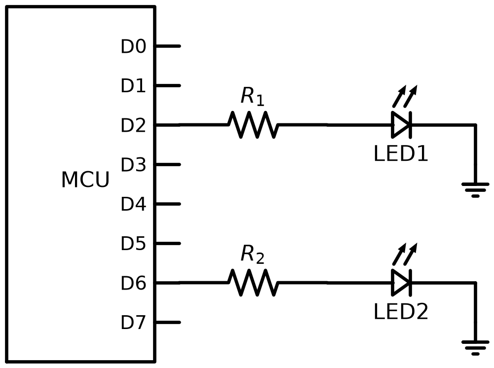

# L06 – Lektionsuppgifter

## Del 1 – Repetitionsuppgifter
### 1.1 – Potensregler
Förenkla (positiva exponenter i svaret):

**a)** $\dfrac{10^6 \cdot 10^{-3}}{10^2}$

**b)** $(2 \cdot 10^3)^2$

**c)** $\sqrt{4 \times 10^6}$

---

### 1.2 – Standardform i kretsberäkning
En krets har $U = 3{,}3\thinspace\text{V}$ och $R = 4{,}7\thinspace\text{k}\Omega = 4{,}7 \times 10^3\thinspace\Omega$.

**a)** Beräkna strömmen $I = \dfrac{U}{R}$ och ange svaret i $\text{mA}$ på standardform.

**b)** Beräkna effekten $P = \dfrac{U^2}{R}$ och ange svaret i $\text{mW}$.

---

### 1.3 – Kvadratrot
**a)** Beräkna $\sqrt{144}$.

**b)** Beräkna $\sqrt{0{,}0049}$.

**c)** En resistor dissiperar $P = 2\thinspace\text{W}$ vid spänningen $U$, och $R = 200\thinspace\Omega$. Beräkna $U$ med hjälp av $P = \dfrac{U^2}{R}$.

---

### 1.4 – Lysdioder på en mikrokontroller
En mikrokontroller (MCU) har åtta digitala pinnar D0–D7. Två röda lysdioder, LED1 och LED2, är anslutna till D2 respektive D6 via var sin resistor till jord:



Pinnarna styrs med två 8-bitarsregister, där varje bit hör till en pinne: bit 0 (längst till höger) hör till D0, bit 1 till D1 och så vidare upp till bit 7, som hör till D7:

| Register | Bit = 1 | Bit = 0 |
|----------|---------|---------|
| `DDRD` | Pinnen är en utgång | Pinnen är en ingång |
| `PORTD` | Utgången är hög ($5{,}0\thinspace\text{V}$) | Utgången är låg ($0\thinspace\text{V}$) |

Båda registren har värdet `0x00` från start.

**a)** Lysdiodernas pinnar ska konfigureras som utgångar. Vilket värde ska skrivas till `DDRD` för att bitarna D2 och D6 ska bli $1$? Ange värdet binärt och hexadecimalt.

**b)** LED1 ska tändas. Vilket värde ska skrivas till `PORTD` för att biten D2 ska bli $1$? Ange värdet binärt och hexadecimalt.

**c)** Nu ska även LED2 tändas, **utan** att LED1 släcks. I C görs det med `PORTD |= x`, vilket här fungerar som $\text{PORTD} = \text{PORTD} + x$ i matematiken. Vilket värde ska $x$ ha, och vilket värde får `PORTD` efteråt? Ange värdena binärt och hexadecimalt.

**d)** Matningsspänningen är $V_{CC} = 5{,}0\thinspace\text{V}$ och en röd lysdiod har framspänningen $U_F = 2{,}0\thinspace\text{V}$, så spänningen över resistorn är $V_{CC} - U_F$ när lysdioden lyser. Dimensionera resistorerna så att strömmen genom respektive lysdiod blir ca $10\thinspace\text{mA}$. Välj ett värde ur E12-serien:

```math
10 \quad 12 \quad 15 \quad 18 \quad 22 \quad 27 \quad 33 \quad 39 \quad 47 \quad 56 \quad 68 \quad 82
```

Värdena kan multipliceras med valfri tiopotens, till exempel $47\thinspace\Omega$, $470\thinspace\Omega$ och $4{,}7\thinspace\text{k}\Omega$.

**e)** Beräkna effektförbrukningen i respektive lysdiodkrets (resistor och lysdiod tillsammans) när lysdioden är tänd, med resistorvärdet från d).

---

## Del 2 – Nytt stoff
### 2.1 – Ren andragradsekvation
Strömmen $I$ (i ampere) uppfyller:

```math
50I^2 = 8
```

**a)** Lös ekvationen för $I$.

**b)** Motivera varför den negativa roten bör förkastas i detta eltekniska sammanhang.

---

### 2.2 – Andragradsekvation med PQ-formeln
Lös följande ekvationer med PQ-formeln:

**a)** $x^2 - 5x + 6 = 0$

**b)** $x^2 + 3x - 10 = 0$

**c)** $x^2 - 6x + 9 = 0$

---

### 2.3 – Icke normerad andragradsekvation
Dividera först så att koefficienten framför $x^2$ blir $1$ och lös sedan med PQ-formeln:

**a)** $2x^2 - 7x + 3 = 0$

**b)** $3x^2 + 5x - 2 = 0$

---

### 2.4 – Seriekopplade motstånd
Två seriekopplade motstånd $R_1$ och $R_2$ uppfyller:

```math
R_1 + R_2 = 13\,\Omega \qquad \text{och} \qquad R_1 \cdot R_2 = 36\,\Omega^2
```

**a)** Lös ut $R_2$ ur den första ekvationen och sätt in i den andra, så att du får en andragradsekvation med $R_1$ som obekant.

**b)** Lös ekvationen och ange båda motståndsvärden.

---

## Del 3 – Extrauppgifter
Uppgifterna nedan är extra träning och görs med fördel på egen hand efter lektionen. De flesta går att räkna i huvudet eller med papper och penna.

### 3.1 – Rena andragradsekvationer
Lös ekvationerna:

**a)** $x^2 = 49$

**b)** $3x^2 = 27$

**c)** $x^2 - 5 = 20$

**d)** $2x^2 + 8 = 0$

**e)** $\dfrac{x^2}{4} = 9$

---

### 3.2 – Faktoriseringsmetoden
Lös genom att faktorisera och använda nollproduktmetoden:

**a)** $x^2 - 7x = 0$

**b)** $x^2 - 16 = 0$

**c)** $x^2 + 5x + 6 = 0$

**d)** $2x^2 - 8x = 0$

**e)** $x^2 - 4x + 4 = 0$

---

### 3.3 – PQ-formeln
Lös med PQ-formeln:

**a)** $x^2 + 2x - 8 = 0$

**b)** $x^2 - 8x + 12 = 0$

**c)** $x^2 + x - 12 = 0$

**d)** $x^2 - 2x - 15 = 0$

---

### 3.4 – Normera först
Ekvationerna nedan är inte normerade. Dividera först så att $a = 1$ och lös sedan med PQ-formeln.

**a)** $2x^2 - 10x + 12 = 0$

**b)** $3x^2 + 12x - 15 = 0$

**c)** $-x^2 + 4x - 3 = 0$

---

### 3.5 – Antal reella rötter
Ange antalet reella rötter **utan** att lösa ekvationen fullständigt, genom att undersöka tecknet på uttrycket under rottecknet i PQ-formeln. Normera först vid behov:

**a)** $x^2 - 6x + 5 = 0$

**b)** $x^2 + 4x + 4 = 0$

**c)** $x^2 + x + 3 = 0$

**d)** $2x^2 - 4x + 2 = 0$

**e)** $3x^2 + 2x - 1 = 0$

---

### 3.6 – Kvadratkomplettering
Lös genom kvadratkomplettering:

**a)** $x^2 + 4x - 5 = 0$

**b)** $x^2 - 10x + 21 = 0$

**c)** $x^2 + 6x + 4 = 0$

---

### 3.7 – Ström ur effekt
Effekten i ett motstånd ges av $P = RI^2$.

**a)** $P = 12{,}5\thinspace\text{W}$ och $R = 50\thinspace\Omega$. Beräkna $I$.

**b)** $P = 0{,}18\thinspace\text{W}$ och $R = 200\thinspace\Omega$. Beräkna $I$ i $\text{mA}$.

**c)** En resistor är märkt $470\thinspace\Omega$ och $0{,}5\thinspace\text{W}$. Beräkna den största tillåtna strömmen.

**d)** Varför förkastas den negativa roten i samtliga deluppgifter?

---

### 3.8 – Spänning ur effekt
Effekten kan också skrivas $P = \dfrac{U^2}{R}$.

**a)** $P = 5\thinspace\text{W}$ och $R = 20\thinspace\Omega$. Beräkna $U$.

**b)** $P = 0{,}125\thinspace\text{W}$ och $R = 2\thinspace 000\thinspace\Omega$. Beräkna $U$.

**c)** Ett värmeelement ska avge $P = 1\thinspace 000\thinspace\text{W}$ vid $U = 230\thinspace\text{V}$. Vilken resistans krävs?

---

### 3.9 – Två motstånd ur summa och produkt
**a)** Två motstånd uppfyller $R_1 + R_2 = 20\thinspace\Omega$ och $R_1 R_2 = 96\thinspace\Omega^2$. Bestäm motstånden.

**b)** Två motstånd uppfyller $R_1 + R_2 = 15\thinspace\Omega$ och $R_1 R_2 = 56\thinspace\Omega^2$. Bestäm motstånden.

**c)** Kan två motstånd ha summan $10\thinspace\Omega$ och produkten $30\thinspace\Omega^2$? Motivera med hjälp av PQ-formeln.

---

### 3.10 – Serie- och parallellresistans samtidigt
Två motstånd ger tillsammans $10\thinspace\Omega$ seriekopplade och $2{,}4\thinspace\Omega$ parallellkopplade.

**a)** Visa att $R_1 R_2 = 24\thinspace\Omega^2$.

**b)** Sätt upp och lös andragradsekvationen för motstånden.

**c)** Kontrollera både serie- och parallellresistansen.

---

### 3.11 – Effekt i en belastning
Ett okänt motstånd $R$ är seriekopplat med $R_1 = 4\thinspace\Omega$ och matas med $E = 12\thinspace\text{V}$. Effekten som utvecklas i $R$ ska bli $P = 8\thinspace\text{W}$.

Strömmen i kretsen är $I = \dfrac{E}{R_1 + R}$ och effekten i $R$ är $P = RI^2$.

**a)** Visa att kravet leder till ekvationen $R^2 - 10R + 16 = 0$.

**b)** Lös ekvationen.

**c)** Kontrollera **båda** lösningarna genom att beräkna strömmen och effekten.

**d)** Beräkna effekten i $R$ då $R = 4\thinspace\Omega$ och jämför med de två lösningarna.

---

### 3.12 – Sant eller falskt
Avgör om påståendet är sant eller falskt och motivera kortfattat:

**a)** Varje andragradsekvation har två reella rötter.

**b)** Ekvationen $x^2 = 16$ har lösningen $x = 4$.

**c)** PQ-formeln kan användas direkt på $2x^2 + 4x - 6 = 0$.

**d)** Om uttrycket under rottecknet i PQ-formeln är noll sammanfaller de båda rötterna.

**e)** Om en produkt av två faktorer är noll måste minst en av faktorerna vara noll.

**f)** Ekvationen $x^2 + 4 = 0$ saknar reella lösningar.

---
