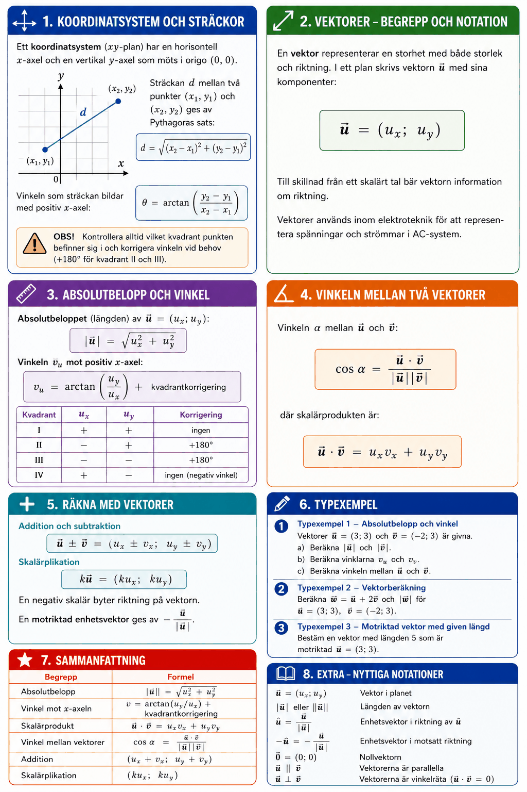

# Bilaga A – Vektorer



## 1. Koordinatsystem och sträckor
Ett **koordinatsystem** (xy-plan) har en horisontell x-axel och en vertikal y-axel som möts i origo $(0, 0)$.

Sträckan $d$ mellan två punkter $(x_1, y_1)$ och $(x_2, y_2)$ ges av Pythagoras sats:

```math
d = \sqrt{(x_2 - x_1)^2 + (y_2 - y_1)^2}
```

Vinkeln som sträckan bildar med positiv x-axel:

```math
\theta = \arctan\!\left(\frac{y_2 - y_1}{x_2 - x_1}\right)
```

**OBS!** Kontrollera alltid vilket kvadrant punkten befinner sig i och korrigera vinkeln vid behov (+180° för kvadrant II och III).

---

## 2. Vektorer – begrepp och notation
En **vektor** representerar en storhet med både storlek och riktning. I ett plan skrivs vektorn $\mathbf{u}$ med sina komponenter:

```math
\mathbf{u} = (u_x;\, u_y)
```

Till skillnad från ett skalärt tal bär vektorn information om riktning. Vektorer används inom elektroteknik för att representera spänningar och strömmar i AC-system.

---

## 3. Absolutbelopp och vinkel
**Absolutbeloppet** (längden) av $\mathbf{u} = (u_x;\, u_y)$:

```math
|\mathbf{u}| = \sqrt{u_x^2 + u_y^2}
```

**Vinkeln** $v_u$ mot positiv x-axel:

```math
v_u = \arctan\!\left(\frac{u_y}{u_x}\right) + \text{kvadrantkorrigering}
```

| Kvadrant | $u_x$ | $u_y$ | Korrigering |
|----------|-------|-------|-------------|
| I | + | + | ingen |
| II | − | + | +180° |
| III | − | − | +180° |
| IV | + | − | ingen (negativ vinkel) |

---

## 4. Vinkeln mellan två vektorer
Vinkeln $\alpha$ mellan $\mathbf{u}$ och $\mathbf{v}$:

```math
\cos \alpha = \frac{\mathbf{u} \cdot \mathbf{v}}{|\mathbf{u}||\mathbf{v}|}
```

där **skalärprodukten** är:

```math
\mathbf{u} \cdot \mathbf{v} = u_x v_x + u_y v_y
```

---

## 5. Räkna med vektorer

### Addition och subtraktion
```math
\mathbf{u} \pm \mathbf{v} = (u_x \pm v_x;\; u_y \pm v_y)
```

### Skalärplikation
```math
k\mathbf{u} = (k u_x;\; k u_y)
```

En negativ skalär byter riktning på vektorn. En motriktad enhetsvektor ges av $-\dfrac{\mathbf{u}}{|\mathbf{u}|}$.

---

## 6. Typexempel

### Typexempel 1 – Absolutbelopp och vinkel
Vektorer $\mathbf{u} = (3;\, 3)$ och $\mathbf{v} = (-2;\, 3)$ är givna.

**a)** Beräkna $|\mathbf{u}|$ och $|\mathbf{v}|$.

**Lösning:**

```math
|\mathbf{u}| = \sqrt{3^2 + 3^2} = \sqrt{18} = 3\sqrt{2} \approx 4{,}24
```

```math
|\mathbf{v}| = \sqrt{(-2)^2 + 3^2} = \sqrt{13} \approx 3{,}61
```

---

**b)** Beräkna vinklarna $v_u$ och $v_v$.

**Lösning:** $\mathbf{u}$ i kvadrant I:

```math
v_u = \arctan\!\left(\frac{3}{3}\right) = 45°
```

$\mathbf{v}$ i kvadrant II, lägg till 180°:

```math
v_v = \arctan\!\left(\frac{3}{-2}\right) + 180° \approx -56{,}3° + 180° = 123{,}7°
```

---

**c)** Beräkna vinkeln mellan $\mathbf{u}$ och $\mathbf{v}$.

**Lösning:**

```math
\mathbf{u} \cdot \mathbf{v} = 3 \cdot (-2) + 3 \cdot 3 = 3
```

```math
\cos \alpha = \frac{3}{3\sqrt{2} \cdot \sqrt{13}} = \frac{3}{\sqrt{234}} \approx 0{,}196 \quad \Rightarrow \quad \alpha \approx 78{,}7°
```

---

### Typexempel 2 – Vektorberäkning
Beräkna $\mathbf{w} = \mathbf{u} + 2\mathbf{v}$ och $|\mathbf{w}|$ för $\mathbf{u} = (3;\, 3)$, $\mathbf{v} = (-2;\, 3)$.

**Lösning:**

```math
\mathbf{w} = (3;\, 3) + 2(-2;\, 3) = (3 - 4;\; 3 + 6) = (-1;\, 9)
```

```math
|\mathbf{w}| = \sqrt{(-1)^2 + 9^2} = \sqrt{82} \approx 9{,}06
```

---

### Typexempel 3 – Motriktad vektor med given längd
Bestäm en vektor med längden $5$ som är motriktad $\mathbf{u} = (3;\, 3)$.

**Lösning:**

```math
\mathbf{w} = -\frac{5}{|\mathbf{u}|}\,\mathbf{u} = -\frac{5}{3\sqrt{2}}(3;\, 3) = \left(-\frac{5}{\sqrt{2}};\; -\frac{5}{\sqrt{2}}\right) \approx (-3{,}54;\; -3{,}54)
```

---

## 7. Sammanfattning

| Begrepp | Formel |
|---------|--------|
| Absolutbelopp | $\|\mathbf{u}\| = \sqrt{u_x^2 + u_y^2}$ |
| Vinkel mot x-axeln | $v = \arctan(u_y/u_x)$ + kvadrantkorrigering |
| Skalärprodukt | $\mathbf{u} \cdot \mathbf{v} = u_x v_x + u_y v_y$ |
| Vinkel mellan vektorer | $\cos\alpha = \frac{\mathbf{u}\cdot\mathbf{v}}{\|\mathbf{u}\|\|\mathbf{v}\|}$ |
| Addition | $(u_x + v_x;\; u_y + v_y)$ |
| Skalärplikation | $(ku_x;\; ku_y)$ |

---
