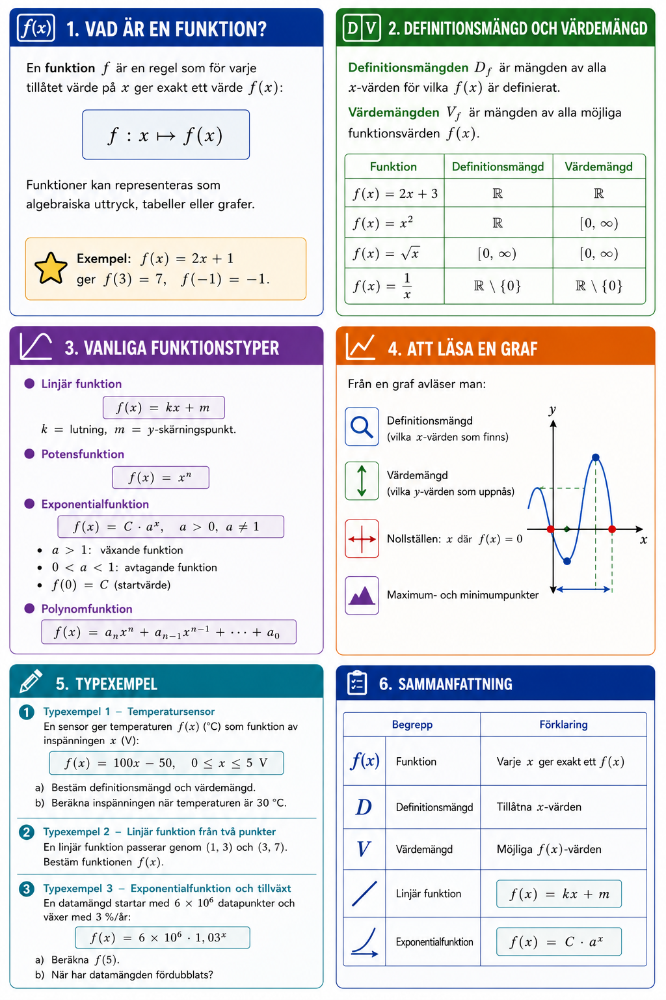

# Bilaga A – Funktioner (del I)



## 1. Vad är en funktion?
En **funktion** $f$ är en regel som för varje tillåtet värde på $x$ ger exakt ett värde $f(x)$:

```math
f : x \mapsto f(x)
```

Funktioner kan representeras som algebraiska uttryck, tabeller eller grafer.

**Exempel:** $f(x) = 2x + 1$ ger $f(3) = 7$, $\,f(-1) = -1$.

---

## 2. Definitionsmängd och värdemängd
**Definitionsmängden** $D_f$ är mängden av alla $x$-värden för vilka $f(x)$ är definierat.

**Värdemängden** $V_f$ är mängden av alla möjliga funktionsvärden $f(x)$.

| Funktion | Definitionsmängd | Värdemängd |
|----------|-----------------|------------|
| $f(x) = 2x + 3$ | $\mathbb{R}$ | $\mathbb{R}$ |
| $f(x) = x^2$ | $\mathbb{R}$ | $[0, \infty)$ |
| $f(x) = \sqrt{x}$ | $[0, \infty)$ | $[0, \infty)$ |
| $f(x) = \dfrac{1}{x}$ | $\mathbb{R} \setminus \{0\}$ | $\mathbb{R} \setminus \{0\}$ |

---

## 3. Vanliga funktionstyper

### Linjär funktion
```math
f(x) = kx + m
```
$k$ = lutning, $m$ = y-skärningspunkt.

### Potensfunktion
```math
f(x) = x^n
```

### Exponentialfunktion
```math
f(x) = C \cdot a^x, \quad a > 0,\, a \neq 1
```
* $a > 1$: växande funktion
* $0 < a < 1$: avtagande funktion
* $f(0) = C$ (startvärde)

### Polynomfunktion
```math
f(x) = a_n x^n + a_{n-1}x^{n-1} + \cdots + a_0
```

---

## 4. Att läsa en graf
Från en graf avläser man:
* Definitionsmängd (vilka $x$-värden som finns)
* Värdemängd (vilka $y$-värden som uppnås)
* Nollställen: $x$ där $f(x) = 0$
* Maximum- och minimumpunkter

---

## 5. Typexempel

### Typexempel 1 – Temperatursensor
En sensor ger temperaturen $f(x)$ (°C) som funktion av inspänningen $x$ (V):

```math
f(x) = 100x - 50, \quad 0 \leq x \leq 5\,\text{V}
```

**a)** Bestäm definitionsmängd och värdemängd.

**Lösning:** $D_f = [0, 5]\,\text{V}$

```math
f(0) = -50\,°\text{C}, \quad f(5) = 450\,°\text{C} \quad \Rightarrow \quad V_f = [-50, 450]\,°\text{C}
```

**b)** Beräkna inspänningen när temperaturen är $30\,°\text{C}$.

```math
100x - 50 = 30 \quad \Rightarrow \quad x = 0{,}8\,\text{V}
```

---

### Typexempel 2 – Linjär funktion från två punkter
En linjär funktion passerar genom $(1, 3)$ och $(3, 7)$.

**Lösning:**

```math
k = \frac{7 - 3}{3 - 1} = 2
```

Sätt in $(1, 3)$: $m = 3 - 2 \cdot 1 = 1$

```math
f(x) = 2x + 1
```

---

### Typexempel 3 – Exponentialfunktion och tillväxt
En datamängd startar med $6 \times 10^6$ datapunkter och växer med $3\,\%$/år:

```math
f(x) = 6 \times 10^6 \cdot 1{,}03^x
```

**a)** Beräkna $f(5)$.

```math
f(5) = 6 \times 10^6 \cdot 1{,}03^5 \approx 6{,}96 \times 10^6
```

**b)** När har datamängden fördubblats?

```math
1{,}03^x = 2 \quad \Rightarrow \quad x = \frac{\log 2}{\log 1{,}03} \approx 23{,}5\,\text{år}
```

---

## 6. Sammanfattning

| Begrepp | Förklaring |
|---------|-----------|
| Funktion | Varje $x$ ger exakt ett $f(x)$ |
| Definitionsmängd | Tillåtna $x$-värden |
| Värdemängd | Möjliga $f(x)$-värden |
| Linjär funktion | $f(x) = kx + m$ |
| Exponentialfunktion | $f(x) = C \cdot a^x$ |

---
