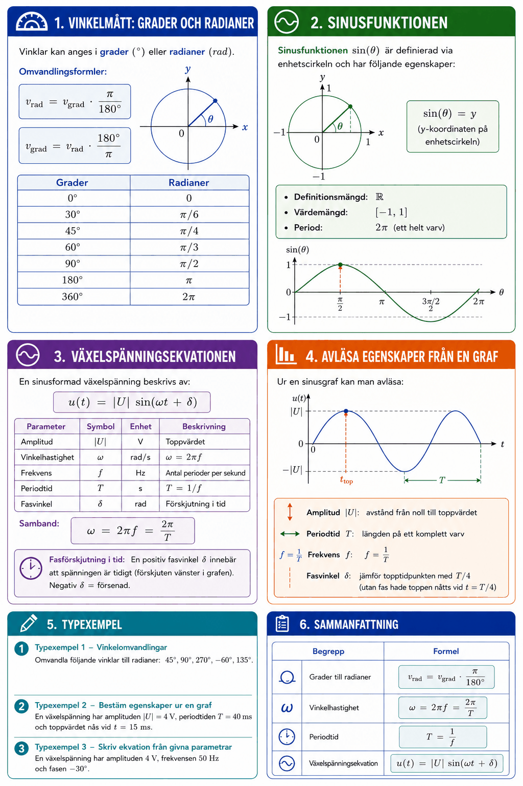

# Bilaga A – Trigonometriska funktioner



## 1. Vinkelmått: grader och radianer
Vinklar kan anges i **grader** (°) eller **radianer** (rad).

Omvandlingsformler:

```math
v_{\text{rad}} = v_{\text{grad}} \cdot \frac{\pi}{180°}
```

```math
v_{\text{grad}} = v_{\text{rad}} \cdot \frac{180°}{\pi}
```

| Grader | Radianer |
|--------|----------|
| 0° | 0 |
| 30° | $\pi/6$ |
| 45° | $\pi/4$ |
| 60° | $\pi/3$ |
| 90° | $\pi/2$ |
| 180° | $\pi$ |
| 360° | $2\pi$ |

---

## 2. Sinusfunktionen
Sinusfunktionen $\sin(\theta)$ är definierad via enhetscirkeln och har följande egenskaper:
* Definitionsmängd: $\mathbb{R}$
* Värdemängd: $[-1, 1]$
* Period: $2\pi$ (ett helt varv)

---

## 3. Växelspänningsekvationen
En sinusformad växelspänning beskrivs av:

```math
u(t) = |U| \sin(\omega t + \delta)
```

| Parameter | Symbol | Enhet | Beskrivning |
|-----------|--------|-------|-------------|
| Amplitud | $|U|$ | V | Toppvärdet |
| Vinkelhastighet | $\omega$ | rad/s | $\omega = 2\pi f$ |
| Frekvens | $f$ | Hz | Antal perioder per sekund |
| Periodtid | $T$ | s | $T = 1/f$ |
| Fasvinkel | $\delta$ | rad | Förskjutning i tid |

**Samband:**

```math
\omega = 2\pi f = \frac{2\pi}{T}
```

**Fasförskjutning i tid:** En positiv fasvinkel $\delta$ innebär att spänningen är *tidigt* (förskjuten vänster i grafen). Negativ $\delta$ = försenad.

---

## 4. Avläsa egenskaper från en graf
Ur en sinusgraf kan man avläsa:
* **Amplitud** $|U|$: avstånd från noll till toppvärdet
* **Periodtid** $T$: längden på ett komplett varv
* **Frekvens** $f = 1/T$
* **Fasvinkel** $\delta$: jämför topptidpunkten med $T/4$ (utan fas hade toppen nåtts vid $t = T/4$)

---

## 5. Typexempel

### Typexempel 1 – Vinkelomvandlingar
Omvandla följande vinklar till radianer: $45°$, $90°$, $270°$, $-60°$, $135°$.

**Lösning** (formeln $v_{\text{rad}} = v_{\text{grad}} \cdot \pi/180°$):

```math
45° \to \frac{\pi}{4}, \quad 90° \to \frac{\pi}{2}, \quad 270° \to \frac{3\pi}{2}, \quad -60° \to -\frac{\pi}{3}, \quad 135° \to \frac{3\pi}{4}
```

---

### Typexempel 2 – Bestäm egenskaper ur en graf
En växelspänning har amplituden $|U| = 4\,\text{V}$, periodtiden $T = 40\,\text{ms}$ och toppvärdet nås vid $t = 15\,\text{ms}$.

**Beräkna $\omega$:**

```math
f = \frac{1}{T} = \frac{1}{0{,}04} = 25\,\text{Hz}, \quad \omega = 2\pi \cdot 25 = 50\pi\,\text{rad/s}
```

**Beräkna $\delta$:** Utan fasförskjutning nås toppen vid $T/4 = 10\,\text{ms}$. Toppen nås vid $15\,\text{ms}$, alltså $5\,\text{ms}$ för sent → negativ fas:

```math
\delta = -2\pi \cdot \frac{5\,\text{ms}}{40\,\text{ms}} = -\frac{\pi}{4}\,\text{rad}
```

**Ekvationen:**

```math
u(t) = 4\sin\!\left(50\pi t - \frac{\pi}{4}\right)\,\text{V}
```

---

### Typexempel 3 – Skriv ekvation från givna parametrar
En växelspänning har amplituden $4\,\text{V}$, frekvensen $50\,\text{Hz}$ och fasen $-30°$.

**Lösning:**

```math
\delta = \frac{-30° \cdot \pi}{180°} = -\frac{\pi}{6}\,\text{rad}, \quad \omega = 2\pi \cdot 50 = 100\pi\,\text{rad/s}
```

```math
u(t) = 4\sin\!\left(100\pi t - \frac{\pi}{6}\right)\,\text{V}
```

---

## 6. Sammanfattning

| Begrepp | Formel |
|---------|--------|
| Grader till radianer | $v_{\text{rad}} = v_{\text{grad}} \cdot \pi/180°$ |
| Vinkelhastighet | $\omega = 2\pi f = 2\pi/T$ |
| Periodtid | $T = 1/f$ |
| Växelspänningsekvation | $u(t) = \|U\|\sin(\omega t + \delta)$ |

---
