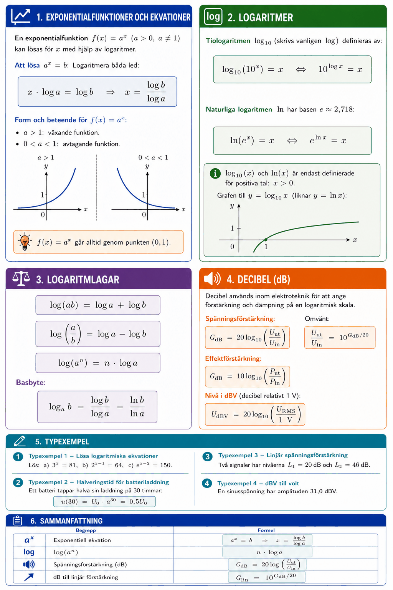

# Bilaga A – Exponentialfunktioner, logaritmer samt decibel



## 1. Exponentialfunktioner och ekvationer
En **exponentialfunktion** $f(x) = a^x$ ($a > 0$, $a \neq 1$) kan lösas för $x$ med hjälp av logaritmer.

**Att lösa $a^x = b$:** Logaritmera båda led:

```math
x \cdot \log a = \log b \quad \Rightarrow \quad x = \frac{\log b}{\log a}
```

---

## 2. Logaritmer
**Tiologaritmen** $\log_{10}$ (skrivs vanligen $\log$) definieras av:

```math
\log_{10}(10^x) = x \quad \Leftrightarrow \quad 10^{\log x} = x
```

**Naturliga logaritmen** $\ln$ har basen $e \approx 2{,}718$:

```math
\ln(e^x) = x \quad \Leftrightarrow \quad e^{\ln x} = x
```

---

## 3. Logaritmlagar
```math
\log(ab) = \log a + \log b
```

```math
\log\!\left(\frac{a}{b}\right) = \log a - \log b
```

```math
\log(a^n) = n \cdot \log a
```

**Basbyte:**

```math
\log_a b = \frac{\log b}{\log a} = \frac{\ln b}{\ln a}
```

---

## 4. Decibel (dB)
Decibel används inom elektroteknik för att ange förstärkning och dämpning på en logaritmisk skala.

**Spänningsförstärkning:**

```math
G_{\text{dB}} = 20 \log_{10}\!\left(\frac{U_{\text{ut}}}{U_{\text{in}}}\right)
```

Omvänt:

```math
\frac{U_{\text{ut}}}{U_{\text{in}}} = 10^{G_{\text{dB}}/20}
```

**Effektförstärkning:**

```math
G_{\text{dB}} = 10 \log_{10}\!\left(\frac{P_{\text{ut}}}{P_{\text{in}}}\right)
```

**Nivå i dBV** (decibel relativt $1\,\text{V}$):

```math
U_{\text{dBV}} = 20 \log_{10}\!\left(\frac{U_{\text{RMS}}}{1\,\text{V}}\right)
```

---

## 5. Typexempel

### Typexempel 1 – Lösa logaritmiska ekvationer
Lös: **a)** $3^x = 81$, **b)** $2^{x-1} = 64$, **c)** $e^{x-2} = 150$.

**Lösning a)** $3^x = 3^4 \Rightarrow x = 4$. (Alternativt: $x = \log 81 / \log 3 = 4$.)

**Lösning b)**

```math
(x-1)\log 2 = \log 64 \quad \Rightarrow \quad x - 1 = \frac{\log 64}{\log 2} = 6 \quad \Rightarrow \quad x = 7
```

**Lösning c)**

```math
x - 2 = \ln 150 \approx 5{,}01 \quad \Rightarrow \quad x \approx 7{,}01
```

---

### Typexempel 2 – Halveringstid för batteriladdning
Ett batteri tappar halva sin laddning på $30$ timmar:

```math
u(30) = U_0 \cdot a^{30} = 0{,}5 U_0
```

**Beräkna förändringsfaktorn $a$:**

```math
a^{30} = 0{,}5 \quad \Rightarrow \quad a = 0{,}5^{1/30} \approx 0{,}977
```

**När återstår $20\,\%$?**

```math
0{,}977^t = 0{,}2 \quad \Rightarrow \quad t = \frac{\log 0{,}2}{\log 0{,}977} \approx 69{,}7\,\text{h}
```

---

### Typexempel 3 – Linjär spänningsförstärkning
Två signaler har nivåerna $L_1 = 20\,\text{dB}$ och $L_2 = 46\,\text{dB}$.

```math
G_{\text{dB}} = L_2 - L_1 = 26\,\text{dB}
```

```math
G_{\text{lin}} = 10^{26/20} = 10^{1{,}3} \approx 20
```

---

### Typexempel 4 – dBV till volt
En sinusspänning har amplituden $31{,}0\,\text{dBV}$.

```math
U_{\text{RMS}} = 10^{31{,}0/20} \approx 35{,}5\,\text{V}
```

```math
|U| = U_{\text{RMS}} \cdot \sqrt{2} \approx 35{,}5 \cdot 1{,}414 \approx 50{,}2\,\text{V}
```

---

## 6. Sammanfattning

| Begrepp | Formel |
|---------|--------|
| Exponentiell ekvation | $a^x = b \Rightarrow x = \log b / \log a$ |
| $\log(a^n)$ | $n \cdot \log a$ |
| Spänningsförstärkning (dB) | $G_{\text{dB}} = 20\log(U_{\text{ut}}/U_{\text{in}})$ |
| dB till linjär förstärkning | $G_{\text{lin}} = 10^{G_{\text{dB}}/20}$ |

---
