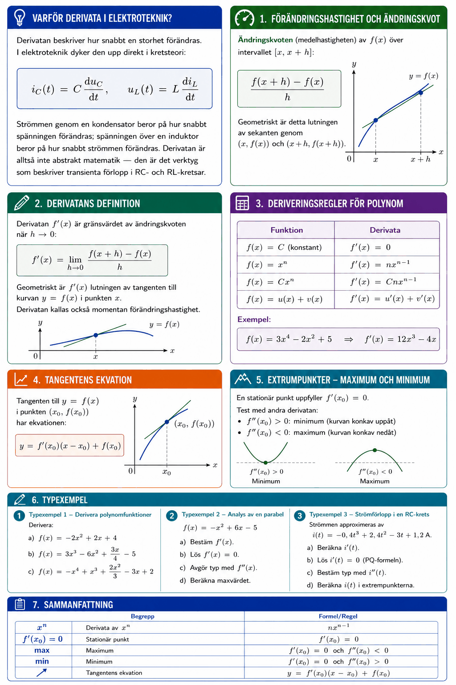

# Bilaga A – Derivata (del I)



## Varför derivata i elektroteknik?
Derivatan beskriver hur snabbt en storhet förändras. I elektroteknik dyker den upp direkt i kretsteori:

```math
i_C(t) = C \frac{du_C}{dt}, \qquad u_L(t) = L \frac{di_L}{dt}
```

Strömmen genom en kondensator beror på hur snabbt spänningen förändras; spänningen över en induktor beror på hur snabbt strömmen förändras. Derivatan är alltså inte abstrakt matematik — den är det verktyg som beskriver transienta förlopp i RC- och RL-kretsar.

---

## 1. Förändringshastighet och ändringskvot
**Ändringskvoten** (medelhastigheten) av $f(x)$ över intervallet $[x, x+h]$:

```math
\frac{f(x+h) - f(x)}{h}
```

Geometriskt är detta lutningen av **sekanten** genom $(x, f(x))$ och $(x+h, f(x+h))$.

---

## 2. Derivatans definition
Derivatan $f'(x)$ är gränsvärdet av ändringskvoten när $h \to 0$:

```math
f'(x) = \lim_{h \to 0} \frac{f(x+h) - f(x)}{h}
```

Geometriskt är $f'(x)$ **lutningen av tangenten** till kurvan $y = f(x)$ i punkten $x$.

Derivatan kallas också **momentan förändringshastighet**.

---

## 3. Deriveringsregler för polynom

| Funktion | Derivata |
|----------|----------|
| $f(x) = C$ (konstant) | $f'(x) = 0$ |
| $f(x) = x^n$ | $f'(x) = nx^{n-1}$ |
| $f(x) = Cx^n$ | $f'(x) = Cnx^{n-1}$ |
| $f(x) = u(x) + v(x)$ | $f'(x) = u'(x) + v'(x)$ |

**Exempel:**

```math
f(x) = 3x^4 - 2x^2 + 5 \quad \Rightarrow \quad f'(x) = 12x^3 - 4x
```

---

## 4. Tangentens ekvation
Tangenten till $y = f(x)$ i punkten $(x_0, f(x_0))$ har ekvationen:

```math
y = f'(x_0)(x - x_0) + f(x_0)
```

---

## 5. Extrempunkter – maximum och minimum
En **stationär punkt** uppfyller $f'(x_0) = 0$.

**Test med andra derivatan:**
* $f''(x_0) > 0$: **minimum** (kurvan konkav uppåt)
* $f''(x_0) < 0$: **maximum** (kurvan konkav nedåt)

---

## 6. Typexempel

### Typexempel 1 – Derivera polynomfunktioner
Derivera:\
**a)** $f(x) = -2x^2 + 2x + 4$\
**b)** $f(x) = 3x^3 - 6x^2 + \dfrac{3x}{4} - 5$\
**c)** $f(x) = -x^4 + x^3 + \dfrac{2x^2}{3} - 3x + 2$

**Lösning:**

**a)** $f'(x) = -4x + 2$

**b)** $f'(x) = 9x^2 - 12x + \dfrac{3}{4}$

**c)** $f'(x) = -4x^3 + 3x^2 + \dfrac{4x}{3} - 3$

---

### Typexempel 2 – Analys av en parabel
$f(x) = -x^2 + 6x - 5$

**a)** Bestäm $f'(x)$.

```math
f'(x) = -2x + 6
```

**b)** Lös $f'(x) = 0$.

```math
-2x + 6 = 0 \quad \Rightarrow \quad x = 3
```

**c)** Avgör typ med $f''(x)$.

```math
f''(x) = -2 < 0 \quad \Rightarrow \quad \text{maximum}
```

**d)** Beräkna maxvärdet.

```math
f(3) = -9 + 18 - 5 = 4
```

Maximipunkt: $(3, 4)$.

---

### Typexempel 3 – Strömförlopp i en RC-krets
Strömmen approximeras av $i(t) = -0{,}4t^3 + 2{,}4t^2 - 3t + 1{,}2$ A.

**a)** Beräkna $i'(t)$.

```math
i'(t) = -1{,}2t^2 + 4{,}8t - 3
```

**b)** Lös $i'(t) = 0$ (PQ-formeln):

```math
t^2 - 4t + 2{,}5 = 0 \quad \Rightarrow \quad t = 2 \pm \sqrt{1{,}5}
```

```math
t_1 \approx 0{,}78\,\text{s}, \quad t_2 \approx 3{,}22\,\text{s}
```

**c)** $i''(t) = -2{,}4t + 4{,}8$

$i''(0{,}78) \approx 2{,}9 > 0$ → minimum vid $t_1$

$i''(3{,}22) \approx -2{,}9 < 0$ → maximum vid $t_2$

**d)**

```math
i(0{,}78) \approx 0{,}13\,\text{A} \quad \text{(minimum)}, \quad i(3{,}22) \approx 3{,}07\,\text{A} \quad \text{(maximum)}
```

---

## 7. Sammanfattning

| Begrepp | Formel/Regel |
|---------|-------------|
| Derivata av $x^n$ | $nx^{n-1}$ |
| Stationär punkt | $f'(x_0) = 0$ |
| Maximum | $f'(x_0) = 0$ och $f''(x_0) < 0$ |
| Minimum | $f'(x_0) = 0$ och $f''(x_0) > 0$ |
| Tangentens ekvation | $y = f'(x_0)(x - x_0) + f(x_0)$ |

---
