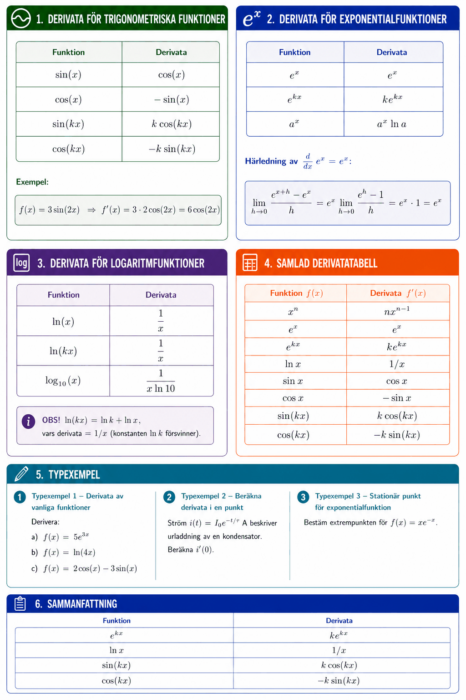

# Bilaga A – Derivata (del II)



## 1. Derivata för trigonometriska funktioner

| Funktion | Derivata |
|----------|----------|
| $\sin(x)$ | $\cos(x)$ |
| $\cos(x)$ | $-\sin(x)$ |
| $\sin(kx)$ | $k\cos(kx)$ |
| $\cos(kx)$ | $-k\sin(kx)$ |

**Exempel:**

```math
f(x) = 3\sin(2x) \quad \Rightarrow \quad f'(x) = 3 \cdot 2\cos(2x) = 6\cos(2x)
```

---

## 2. Derivata för exponentialfunktioner

| Funktion | Derivata |
|----------|----------|
| $e^x$ | $e^x$ |
| $e^{kx}$ | $k e^{kx}$ |
| $a^x$ | $a^x \ln a$ |

**Härledning av $\frac{d}{dx}e^x = e^x$:**

```math
\lim_{h \to 0} \frac{e^{x+h} - e^x}{h} = e^x \lim_{h \to 0} \frac{e^h - 1}{h} = e^x \cdot 1 = e^x
```

---

## 3. Derivata för logaritmfunktioner

| Funktion | Derivata |
|----------|----------|
| $\ln(x)$ | $\dfrac{1}{x}$ |
| $\ln(kx)$ | $\dfrac{1}{x}$ |
| $\log_{10}(x)$ | $\dfrac{1}{x \ln 10}$ |

**OBS!** $\ln(kx) = \ln k + \ln x$, vars derivata $= 1/x$ (konstanten $\ln k$ försvinner).

---

## 4. Samlad derivatatabell

| Funktion $f(x)$ | Derivata $f'(x)$ |
|-----------------|------------------|
| $x^n$ | $nx^{n-1}$ |
| $e^x$ | $e^x$ |
| $e^{kx}$ | $ke^{kx}$ |
| $\ln x$ | $1/x$ |
| $\sin x$ | $\cos x$ |
| $\cos x$ | $-\sin x$ |
| $\sin(kx)$ | $k\cos(kx)$ |
| $\cos(kx)$ | $-k\sin(kx)$ |

---

## 5. Typexempel

### Typexempel 1 – Derivata av vanliga funktioner
Derivera:\
**a)** $f(x) = 5e^{3x}$\
**b)** $f(x) = \ln(4x)$\
**c)** $f(x) = 2\cos(x) - 3\sin(x)$

**Lösning:**

**a)** $f'(x) = 5 \cdot 3e^{3x} = 15e^{3x}$

**b)** $f'(x) = 1/x$

**c)** $f'(x) = -2\sin(x) - 3\cos(x)$

---

### Typexempel 2 – Beräkna derivata i en punkt
Ström $i(t) = I_0 e^{-t/\tau}$ A beskriver urladdning av en kondensator. Beräkna $i'(0)$.

**Lösning:**

```math
i'(t) = -\frac{I_0}{\tau} e^{-t/\tau} \quad \Rightarrow \quad i'(0) = -\frac{I_0}{\tau}
```

$i'(0)$ är den momentana strömförändringshastigheten vid $t = 0$.

---

### Typexempel 3 – Stationär punkt för exponentialfunktion
Bestäm extrempunkten för $f(x) = xe^{-x}$.

**Lösning** (produktregeln tillämpas direkt):

```math
f'(x) = e^{-x} + x \cdot (-e^{-x}) = e^{-x}(1 - x)
```

$f'(x) = 0 \Rightarrow x = 1$ (ty $e^{-x} \neq 0$)

```math
f''(x) = -e^{-x}(1-x) + e^{-x}(-1) = e^{-x}(x - 2)
```

$f''(1) = e^{-1}(1-2) = -e^{-1} < 0$ → **maximum** vid $(1, e^{-1}) \approx (1, 0{,}37)$.

---

## 6. Sammanfattning

| Funktion | Derivata |
|----------|----------|
| $e^{kx}$ | $ke^{kx}$ |
| $\ln x$ | $1/x$ |
| $\sin(kx)$ | $k\cos(kx)$ |
| $\cos(kx)$ | $-k\sin(kx)$ |

---
