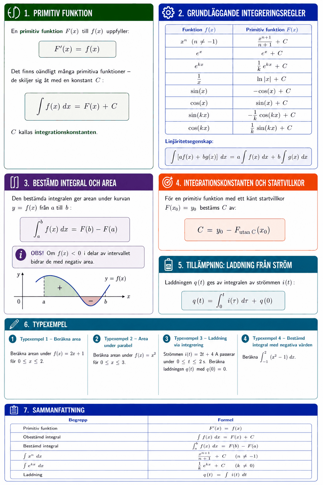

# Bilaga A – Integraler



## 1. Primitiv funktion
En **primitiv funktion** $F(x)$ till $f(x)$ uppfyller:

```math
F'(x) = f(x)
```

Det finns oändligt många primitiva funktioner – de skiljer sig åt med en konstant $C$:

```math
\int f(x)\,dx = F(x) + C
```

$C$ kallas **integrationskonstanten**.

---

## 2. Grundläggande integreringsregler

| Funktion $f(x)$ | Primitiv funktion $F(x)$ |
|-----------------|--------------------------|
| $x^n$ ($n \neq -1$) | $\dfrac{x^{n+1}}{n+1} + C$ |
| $e^x$ | $e^x + C$ |
| $e^{kx}$ | $\dfrac{1}{k}e^{kx} + C$ |
| $\dfrac{1}{x}$ | $\ln|x| + C$ |
| $\sin(x)$ | $-\cos(x) + C$ |
| $\cos(x)$ | $\sin(x) + C$ |
| $\sin(kx)$ | $-\dfrac{1}{k}\cos(kx) + C$ |
| $\cos(kx)$ | $\dfrac{1}{k}\sin(kx) + C$ |

**Linjäritetsegenskap:**

```math
\int [af(x) + bg(x)]\,dx = a\int f(x)\,dx + b\int g(x)\,dx
```

---

## 3. Bestämd integral och area
Den **bestämda integralen** ger arean under kurvan $y = f(x)$ från $a$ till $b$:

```math
\int_a^b f(x)\,dx = F(b) - F(a)
```

**OBS!** Om $f(x) < 0$ i delar av intervallet bidrar de med negativ area.

---

## 4. Integrationskonstanten och startvillkor
För en primitiv funktion med ett känt startvillkor $F(x_0) = y_0$ bestäms $C$ av:

```math
C = y_0 - F_{\text{utan C}}(x_0)
```

---

## 5. Tillämpning: Laddning från ström
Laddningen $q(t)$ ges av integralen av strömmen $i(t)$:

```math
q(t) = \int_0^t i(\tau)\,d\tau + q(0)
```

---

## 6. Typexempel

### Typexempel 1 – Beräkna area
Beräkna arean under $f(x) = 2x + 1$ för $0 \leq x \leq 2$.

**Lösning:**

```math
\int_0^2 (2x + 1)\,dx = \left[x^2 + x\right]_0^2 = (4 + 2) - 0 = 6
```

---

### Typexempel 2 – Area under parabel
Beräkna arean under $f(x) = x^2$ för $0 \leq x \leq 3$.

**Lösning:**

```math
\int_0^3 x^2\,dx = \left[\frac{x^3}{3}\right]_0^3 = \frac{27}{3} - 0 = 9
```

---

### Typexempel 3 – Laddning via integrering
Strömmen $i(t) = 2t + 4$ A passerar under $0 \leq t \leq 2\,\text{s}$. Beräkna laddningen $q(t)$ med $q(0) = 0$.

**Lösning:**

```math
q(t) = \int_0^t (2\tau + 4)\,d\tau = \left[\tau^2 + 4\tau\right]_0^t = t^2 + 4t
```

**Primitiv funktion med startvillkor:** $I(t) = t^2 + 4t$, $\;I(0) = 0$ ✓

```math
q(2) = 4 + 8 = 12\,\text{C}
```

---

### Typexempel 4 – Bestämd integral med negativa värden
Beräkna $\displaystyle\int_{-1}^{2} (x^2 - 1)\,dx$.

**Lösning:**

```math
\left[\frac{x^3}{3} - x\right]_{-1}^{2} = \left(\frac{8}{3} - 2\right) - \left(-\frac{1}{3} + 1\right) = \frac{8}{3} - 2 + \frac{1}{3} - 1 = 3 - 3 = 0
```

(Positiva och negativa areor tar ut varandra.)

---

## 7. Sammanfattning

| Begrepp | Formel |
|---------|--------|
| Primitiv funktion | $F'(x) = f(x)$ |
| Obestämd integral | $\int f(x)\,dx = F(x) + C$ |
| Bestämd integral | $\int_a^b f(x)\,dx = F(b) - F(a)$ |
| $\int x^n\,dx$ | $x^{n+1}/(n+1) + C$ |
| $\int e^{kx}\,dx$ | $(1/k)e^{kx} + C$ |
| Laddning | $q(t) = \int i(t)\,dt$ |

---
