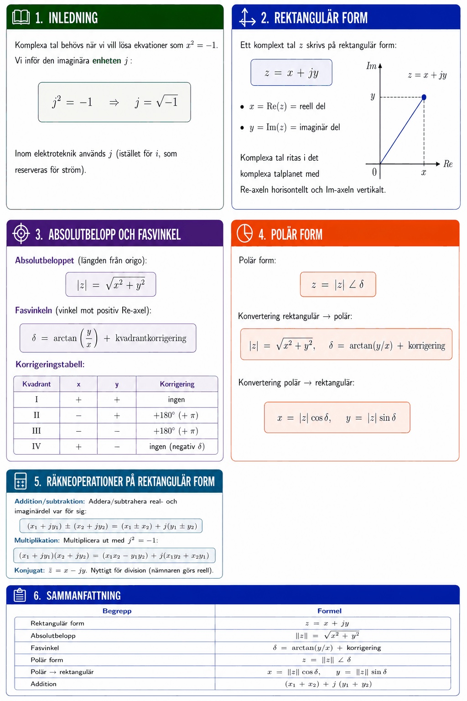

# Bilaga A – Komplexa tal (del I)



## 1. Inledning
Komplexa tal behövs när vi vill lösa ekvationer som $x^2 = -1$. Vi inför den **imaginära enheten** $j$:

```math
j^2 = -1 \quad \Rightarrow \quad j = \sqrt{-1}
```

Inom elektroteknik används $j$ (istället för $i$, som reserveras för ström).

---

## 2. Rektangulär form
Ett komplext tal $z$ skrivs på **rektangulär form**:

```math
z = x + jy
```

* $x = \text{Re}(z)$ = reell del
* $y = \text{Im}(z)$ = imaginär del

Komplexa tal ritas i det **komplexa talplanet** med Re-axeln horisontellt och Im-axeln vertikalt.

---

## 3. Absolutbelopp och fasvinkel
**Absolutbeloppet** (längden från origo):

```math
|z| = \sqrt{x^2 + y^2}
```

**Fasvinkeln** (vinkel mot positiv Re-axel):

```math
\delta = \arctan\!\left(\frac{y}{x}\right) + \text{kvadrantkorrigering}
```

**Korrigeringstabell:**

| Kvadrant | $x$ | $y$ | Korrigering |
|----------|-----|-----|-------------|
| I | + | + | ingen |
| II | − | + | +180° (+ π) |
| III | − | − | +180° (+ π) |
| IV | + | − | ingen (negativ δ) |

---

## 4. Polär form
**Polär form:**

```math
z = |z| \angle \delta
```

**Konvertering rektangulär → polär:**

```math
|z| = \sqrt{x^2 + y^2}, \quad \delta = \arctan(y/x) + \text{korrigering}
```

**Konvertering polär → rektangulär:**

```math
x = |z|\cos\delta, \quad y = |z|\sin\delta
```

---

## 5. Räkneoperationer på rektangulär form

**Addition/subtraktion:** Addera/subtrahera real- och imaginärdel var för sig:

```math
(x_1 + jy_1) \pm (x_2 + jy_2) = (x_1 \pm x_2) + j(y_1 \pm y_2)
```

**Multiplikation:** Multiplicera ut med $j^2 = -1$:

```math
(x_1 + jy_1)(x_2 + jy_2) = (x_1 x_2 - y_1 y_2) + j(x_1 y_2 + x_2 y_1)
```

**Konjugat:** $\bar{z} = x - jy$. Nyttigt för division (nämnaren görs reell).

---

## 6. Typexempel

### Typexempel 1 – Komplexa tal i talplanet
Markera $z_1 = 3 + j4$ och $z_2 = -2 - j3$ i det komplexa talplanet och beräkna absolutbelopp och fasvinkel.

**Lösning $z_1 = 3 + j4$** (kvadrant I):

```math
|z_1| = \sqrt{9 + 16} = 5, \quad \delta_1 = \arctan\!\left(\frac{4}{3}\right) \approx 53{,}1°
```

Polär form: $z_1 = 5\,\angle\,53{,}1°$

**Lösning $z_2 = -2 - j3$** (kvadrant III, lägg till 180°):

```math
|z_2| = \sqrt{4 + 9} = \sqrt{13} \approx 3{,}61, \quad \delta_2 = \arctan\!\left(\frac{-3}{-2}\right) + 180° \approx 56{,}3° + 180° = 236{,}3°
```

---

### Typexempel 2 – Konvertering: rektangulär → polär
Spänning $U = 3 + j4\,\text{V}$. Bestäm absolutbelopp och fasvinkel.

**Lösning:**

```math
|U| = \sqrt{3^2 + 4^2} = 5\,\text{V}, \quad \delta = \arctan\!\left(\frac{4}{3}\right) \approx 0{,}927\,\text{rad} \approx 53{,}1°
```

Polär form: $U = 5\,\angle\,0{,}927\,\text{rad}$

---

### Typexempel 3 – Konvertering: polär → rektangulär
Ström $I = 10\,\angle\,\pi/4\,\text{mA}$. Bestäm rektangulär form.

**Lösning:**

```math
x = 10\cos\!\left(\frac{\pi}{4}\right) = \frac{10}{\sqrt{2}} \approx 7{,}07\,\text{mA}
```

```math
y = 10\sin\!\left(\frac{\pi}{4}\right) = \frac{10}{\sqrt{2}} \approx 7{,}07\,\text{mA}
```

```math
I = (7{,}07 + j7{,}07)\,\text{mA}
```

---

## 7. Sammanfattning

| Begrepp | Formel |
|---------|--------|
| Rektangulär form | $z = x + jy$ |
| Absolutbelopp | $\|z\| = \sqrt{x^2 + y^2}$ |
| Fasvinkel | $\delta = \arctan(y/x)$ + korrigering |
| Polär form | $z = \|z\|\,\angle\,\delta$ |
| Polär → rektangulär | $x = \|z\|\cos\delta$, $\;y = \|z\|\sin\delta$ |
| Addition | $(x_1+x_2) + j(y_1+y_2)$ |

---
