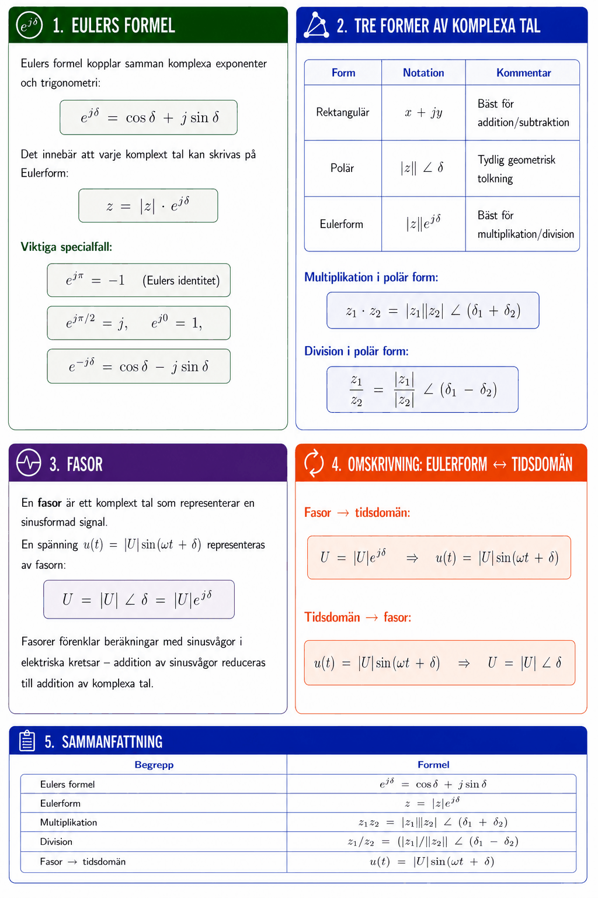

# Bilaga A – Komplexa tal (del II)



## 1. Eulers formel
**Eulers formel** kopplar samman komplexa exponenter och trigonometri:

```math
e^{j\delta} = \cos\delta + j\sin\delta
```

Det innebär att varje komplext tal kan skrivas på **Eulerform**:

```math
z = |z| \cdot e^{j\delta}
```

**Viktiga specialfall:**

```math
e^{j\pi} = -1 \quad \text{(Eulers identitet)}
```

```math
e^{j\pi/2} = j, \quad e^{j0} = 1, \quad e^{-j\delta} = \cos\delta - j\sin\delta
```

---

## 2. Tre former av komplexa tal

| Form | Notation | Kommentar |
|------|---------|-----------|
| Rektangulär | $x + jy$ | Bäst för addition/subtraktion |
| Polär | $\|z\|\,\angle\,\delta$ | Tydlig geometrisk tolkning |
| Eulerform | $\|z\|e^{j\delta}$ | Bäst för multiplikation/division |

**Multiplikation i polär form:**

```math
z_1 \cdot z_2 = |z_1||z_2|\,\angle\,(\delta_1 + \delta_2)
```

**Division i polär form:**

```math
\frac{z_1}{z_2} = \frac{|z_1|}{|z_2|}\,\angle\,(\delta_1 - \delta_2)
```

---

## 3. Fasor
En **fasor** är ett komplext tal som representerar en sinusformad signal. En spänning $u(t) = |U|\sin(\omega t + \delta)$ representeras av fasorn:

```math
U = |U|\,\angle\,\delta = |U|e^{j\delta}
```

Fasorer förenklar beräkningar med sinusvågor i elektriska kretsar – addition av sinusvågor reduceras till addition av komplexa tal.

---

## 4. Omskrivning: Eulerform ↔ tidsdomän

**Fasor → tidsdomän:**

```math
U = |U|e^{j\delta} \quad \Rightarrow \quad u(t) = |U|\sin(\omega t + \delta)
```

**Tidsdomän → fasor:**

```math
u(t) = |U|\sin(\omega t + \delta) \quad \Rightarrow \quad U = |U|\,\angle\,\delta
```

---

## 5. Typexempel

### Typexempel 1 – Vektorer som komplexa tal
Vektorer $\mathbf{a} = (3, 4)$ och $\mathbf{b} = (-2, 4)$ skrivs som komplexa tal och adderas.

**Lösning:**

```math
a = 3 + j4, \quad b = -2 + j4
```

```math
a + b = (3-2) + j(4+4) = 1 + j8
```

```math
|a + b| = \sqrt{1 + 64} = \sqrt{65} \approx 8{,}06
```

---

### Typexempel 2 – Eulerform till rektangulär form
Skriv $u(t) = 3e^{j(100\pi t - \pi/4)}\,\text{V}$ på rektangulär form vid $t = 0$.

**Lösning:**

```math
u(0) = 3e^{-j\pi/4} = 3\!\left(\cos\!\left(-\frac{\pi}{4}\right) + j\sin\!\left(-\frac{\pi}{4}\right)\right) = 3\!\left(\frac{\sqrt{2}}{2} - j\frac{\sqrt{2}}{2}\right) \approx 2{,}12 - j2{,}12\,\text{V}
```

---

### Typexempel 3 – Fasor till tidsdomän
Fasorn $I = 5 - j4\,\text{mA}$, $\omega = 100\pi\,\text{rad/s}$. Skriv $i(t)$ på Eulers form.

**Lösning:**

```math
|I| = \sqrt{25 + 16} = \sqrt{41} \approx 6{,}40\,\text{mA}
```

```math
\delta = \arctan\!\left(\frac{-4}{5}\right) \approx -38{,}7° \approx -0{,}675\,\text{rad}
```

```math
i(t) = 6{,}40 \cdot e^{j(100\pi t - 0{,}675)}\,\text{mA}
```

---

## 6. Sammanfattning

| Begrepp | Formel |
|---------|--------|
| Eulers formel | $e^{j\delta} = \cos\delta + j\sin\delta$ |
| Eulerform | $z = \|z\|e^{j\delta}$ |
| Multiplikation | $z_1 z_2 = \|z_1\|\|z_2\|\,\angle\,(\delta_1+\delta_2)$ |
| Division | $z_1/z_2 = (\|z_1\|/\|z_2\|)\,\angle\,(\delta_1-\delta_2)$ |
| Fasor → tidsdomän | $u(t) = \|U\|\sin(\omega t + \delta)$ |

---
