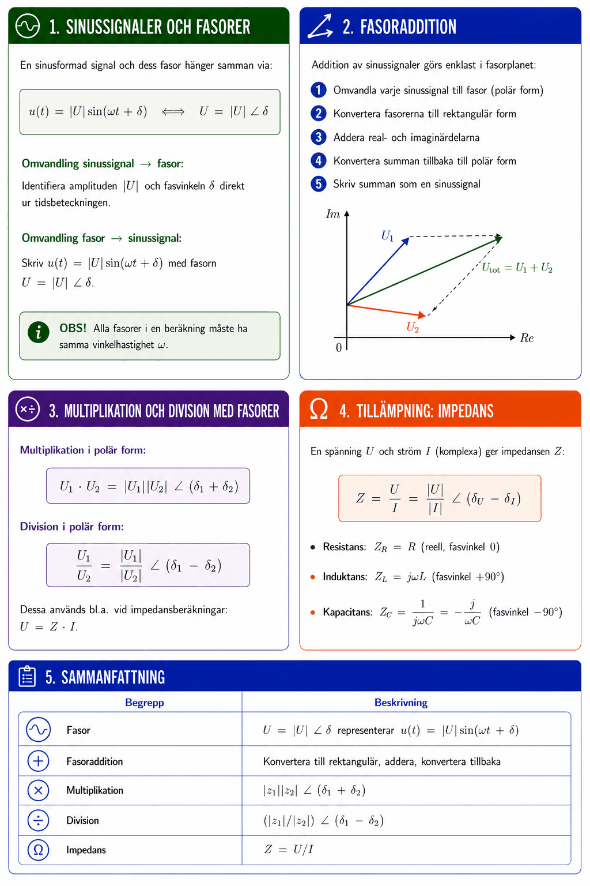

# Bilaga A – Komplexa tal (del III)



## 1. Sinussignaler och fasorer
En sinusformad signal och dess fasor hänger samman via:

```math
u(t) = |U|\sin(\omega t + \delta) \quad \longleftrightarrow \quad U = |U|\,\angle\,\delta
```

**Omvandling sinussignal → fasor:**

Identifiera amplituden $|U|$ och fasvinkeln $\delta$ direkt ur tidsbeteckningen.

**Omvandling fasor → sinussignal:**

Skriv $u(t) = |U|\sin(\omega t + \delta)$ med fasorn $U = |U|\,\angle\,\delta$.

**OBS!** Alla fasorer i en beräkning måste ha **samma vinkelhastighet** $\omega$.

---

## 2. Fasoraddition
Addition av sinussignaler görs enklast i fasorplanet:

1. Omvandla varje sinussignal till fasor (polär form)
2. Konvertera fasorerna till rektangulär form
3. Addera real- och imaginärdelarna
4. Konvertera summan tillbaka till polär form
5. Skriv summan som en sinussignal

---

## 3. Multiplikation och division med fasorer
Multiplikation i polär form:

```math
U_1 \cdot U_2 = |U_1||U_2|\,\angle\,(\delta_1 + \delta_2)
```

Division i polär form:

```math
\frac{U_1}{U_2} = \frac{|U_1|}{|U_2|}\,\angle\,(\delta_1 - \delta_2)
```

Dessa används bl.a. vid impedansberäkningar: $U = Z \cdot I$.

---

## 4. Tillämpning: Impedans
En spänning $U$ och ström $I$ (komplexa) ger impedansen $Z$:

```math
Z = \frac{U}{I} = \frac{|U|}{|I|}\,\angle\,(\delta_U - \delta_I)
```

Resistans: $Z_R = R$ (reell, fasvinkel 0)

Induktans: $Z_L = j\omega L$ (fasvinkel +90°)

Kapacitans: $Z_C = \dfrac{1}{j\omega C} = -\dfrac{j}{\omega C}$ (fasvinkel −90°)

---

## 5. Typexempel

### Typexempel 1 – Fasoraddition
Addera $u_1(t) = 2\sin(\omega t + 45°)\,\text{V}$ och $u_2(t) = 3\sin(\omega t - 60°)\,\text{V}$.

**Steg 1:** Fasorer i polär form:

```math
U_1 = 2\,\angle\,45°, \quad U_2 = 3\,\angle\,-60°
```

**Steg 2:** Konvertera till rektangulär form:

```math
U_1 = 2(\cos 45° + j\sin 45°) = \sqrt{2} + j\sqrt{2} \approx 1{,}414 + j1{,}414
```

```math
U_2 = 3(\cos(-60°) + j\sin(-60°)) = 3(0{,}5 - j0{,}866) = 1{,}5 - j2{,}598
```

**Steg 3:** Addera:

```math
U_{\text{tot}} = (1{,}414 + 1{,}5) + j(1{,}414 - 2{,}598) = 2{,}914 - j1{,}184
```

**Steg 4:** Konvertera till polär:

```math
|U_{\text{tot}}| = \sqrt{2{,}914^2 + 1{,}184^2} \approx 3{,}15\,\text{V}
```

```math
\delta_{\text{tot}} = \arctan\!\left(\frac{-1{,}184}{2{,}914}\right) \approx -22{,}1°
```

**Steg 5:** Tidsdomänen:

```math
u_{\text{tot}}(t) = 3{,}15\sin(\omega t - 22{,}1°)\,\text{V}
```

---

### Typexempel 2 – Beräkna fas ur ekvation
En växelspänning $u(t) = 6\sin(80\pi t + \delta)$ V. Vid $t = 15\,\text{ms}$ är $u = 3\,\text{V}$. Bestäm $\delta$.

**Lösning:**

```math
6\sin(80\pi \cdot 0{,}015 + \delta) = 3 \quad \Rightarrow \quad \sin(1{,}2\pi + \delta) = 0{,}5
```

```math
\delta_1 = \arcsin(0{,}5) - 1{,}2\pi \approx 0{,}5236 - 3{,}7699 \approx -3{,}25\,\text{rad}
```

```math
\delta_2 = \pi - \arcsin(0{,}5) - 1{,}2\pi \approx -1{,}15\,\text{rad}
```

Kontrollräkna båda rötterna ger $u(0{,}015) = 3\,\text{V}$ ✓

---

### Typexempel 3 – Impedansberäkning
En serie-RLC-krets har $R = 10\,\Omega$, $Z_L = j5\,\Omega$, $Z_C = -j3\,\Omega$ vid $\omega = 1000\,\text{rad/s}$.

**Totalimpedans:**

```math
Z = R + Z_L + Z_C = 10 + j5 - j3 = 10 + j2\,\Omega
```

```math
|Z| = \sqrt{100 + 4} \approx 10{,}20\,\Omega, \quad \delta_Z = \arctan(2/10) \approx 11{,}3°
```

---

## 6. Sammanfattning

| Begrepp | Beskrivning |
|---------|-------------|
| Fasor | $U = \|U\|\,\angle\,\delta$ representerar $u(t) = \|U\|\sin(\omega t + \delta)$ |
| Fasoraddition | Konvertera till rektangulär, addera, konvertera tillbaka |
| Multiplikation | $\|z_1\|\|z_2\|\,\angle\,(\delta_1 + \delta_2)$ |
| Division | $(\|z_1\|/\|z_2\|)\,\angle\,(\delta_1 - \delta_2)$ |
| Impedans | $Z = U/I$ |

---
