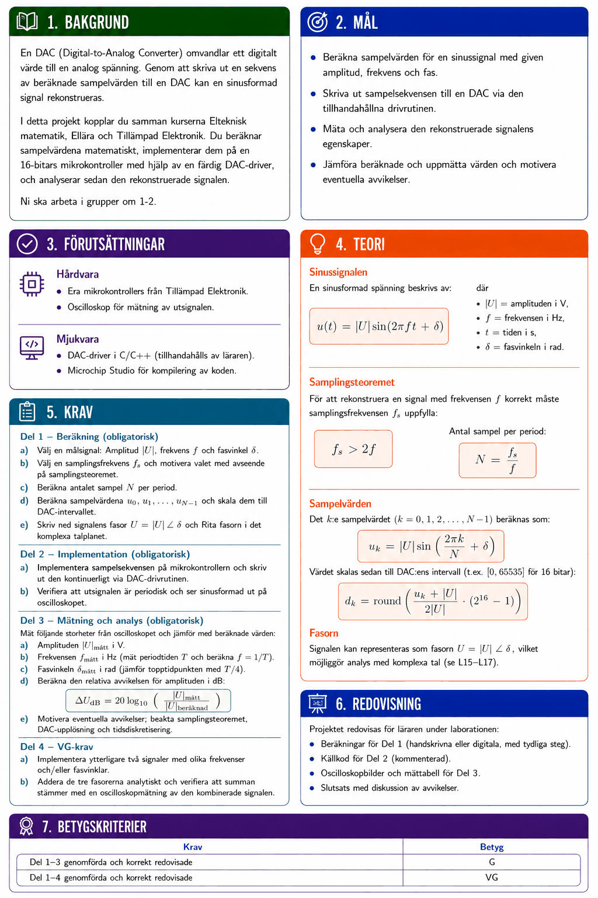

# P01 – Sinusrekonstruktion med DAC



## Bakgrund
En DAC (Digital-to-Analog Converter) omvandlar ett digitalt värde till en analog spänning. Genom att skriva ut en sekvens av beräknade sampelvärden till en DAC kan en sinusformad signal rekonstrueras.

I detta projekt kopplar du samman kurserna **Elteknisk matematik**, **Ellära** och **Tillämpad Elektronik**. Du beräknar sampelvärdena matematiskt, implementerar dem på en mikrokontroller (AVR32DB28) med en 10-bitars DAC med hjälp av en färdig DAC-driver, och analyserar sedan den rekonstruerade signalen.

Ni ska arbeta i grupper om 1-2.

---

## Mål
* Beräkna sampelvärden för en sinussignal med given amplitud, frekvens och fas.
* Skriva ut sampelsekvensen till en DAC via den tillhandahållna drivern.
* Mäta och analysera den rekonstruerade signalens egenskaper.
* Jämföra beräknade och uppmätta värden och motivera eventuella avvikelser.

---

## Förutsättningar

### Hårdvara
* Era mikrokontrollers från **Tillämpad Elektronik.**
* Oscilloskop för mätning av utsignalen.

### Mjukvara
* Application med DAC-driver i C, se [här](./code/README.md).
* Microchip Studio för kompilering av koden.
* [Git för Windows](https://git-scm.com/downloads/win), för att installera **Git Bash**, som används för att klona repot.

> **OBS!** DAC-drivern förutsätter att DAC0:s utgång ligger på `PORTD.PIN6CTRL`, definierat som `DAC_PIN_CTRL` i [dac.c](./code/math_project/source/driver/dac.c). Om ni inte ser någon signal på oscilloskopet, kontrollera kretskortets schema för rätt pinne och uppdatera det makrot till motsvarande `PORTx.PINxCTRL`-register.

### Hämta koden
Projektets kod (drivers, skelettkod för [main.c](./code/math_project/main.c) m.m.) finns i [`code/`](./code/) i detta repo.

**1. Installera Git Bash.** Ladda ner och installera [Git för Windows](https://git-scm.com/downloads/win) (standardinställningarna fungerar bra). Öppna sedan **Git Bash** från Startmenyn för resten av stegen nedan.

**2. Konfigurera en SSH-nyckel mot GitHub** (om ni inte redan har en). Följ GitHub:s guide för att [generera en SSH-nyckel](https://docs.github.com/en/authentication/connecting-to-github-with-ssh/generating-a-new-ssh-key-and-adding-it-to-the-ssh-agent) och [lägga till den i ert GitHub-konto](https://docs.github.com/en/authentication/connecting-to-github-with-ssh/adding-a-new-ssh-key-to-your-github-account).

**3. Klona repot via SSH:**

```bash
git clone git@github.com:Yrgo-26/x.git
```

Öppna sedan `projects/P01/code/math_project/math_project.cproj` i Microchip Studio.

---

## Teori

### Sinussignalen
En sinusformad spänning beskrivs av:

```math
u(t) = |U| \sin(2\pi f t + \delta)
```

där
* $|U|$ = amplituden i V,
* $f$ = frekvensen i Hz,
* $t$ = tiden i s,
* $\delta$ = fasvinkeln i rad.

### Samplingsteoremet
För att rekonstruera en signal med frekvensen $f$ korrekt måste samplingsfrekvensen $f_s$ uppfylla:

```math
f_s > 2f
```

Antal sampel per period:

```math
N = \frac{f_s}{f}
```

### Sampelvärden
Det $k$:e sampelvärdet ($k = 0, 1, 2, \ldots, N-1$) beräknas som:

```math
u_k = |U| \sin\!\left(\frac{2\pi k}{N} + \delta\right)
```

Värdet skalas sedan till DAC:ens intervall ($[0, 1023]$ för en 10-bitars DAC):

```math
d_k = \text{round}\!\left(\frac{u_k + |U|}{2|U|} \cdot (2^{10} - 1)\right)
```

### Fasorn
Signalen kan representeras som fasorn $U = |U|\,\angle\,\delta$, vilket möjliggör analys med komplexa tal (se L15–L17).

---

## Krav

### Del 1 – Beräkning (obligatorisk)
**a)** Välj en målsignal: Amplitud $|U|$, frekvens $f$ och fasvinkel $\delta$.

**b)** Välj en samplingsfrekvens $f_s$ och motivera valet med avseende på samplingsteoremet.

**c)** Beräkna antalet sampel $N$ per period.

**d)** Beräkna sampelvärdena $u_0, u_1, \ldots, u_{N-1}$ och skala dem till DAC-intervallet.

**e)** Skriv ned signalens fasor $U = |U|\,\angle\,\delta$ och Rita fasorn i det komplexa talplanet.

### Del 2 – Implementation (obligatorisk)
**a)** Implementera sampelsekvensen på mikrokontrollern och skriv ut den kontinuerligt via DAC-drivern.

**b)** Verifiera att utsignalen är periodisk och ser sinusformad ut på oscilloskopet.

### Del 3 – Mätning och analys (obligatorisk)
Mät följande storheter från oscilloskopet och jämför med beräknade värden:

**a)** Amplituden $|U|_{\text{mätt}}$ i V.

**b)** Frekvensen $f_{\text{mätt}}$ i Hz (mät periodtiden $T$ och beräkna $f = 1/T$).

**c)** Fasvinkeln $\delta_{\text{mätt}}$ i rad (jämför topptidpunkten med $T/4$).

**d)** Beräkna den relativa avvikelsen för amplituden i dB:

```math
\Delta U_{\text{dB}} = 20\log_{10}\!\left(\frac{|U|_{\text{mätt}}}{|U|_{\text{beräknad}}}\right)
```

**e)** Motivera eventuella avvikelser; beakta samplingsteoremet, DAC-upplösning och tidsdiskretisering.

### Del 4 – VG-krav
**a)** Implementera ytterligare två signaler med olika frekvenser och/eller fasvinklar.

**b)** Addera de tre fasorerna analytiskt och verifiera att summan stämmer med en oscilloskopmätning av den kombinerade signalen.

---

## Redovisning
Projektet redovisas för läraren under laborationen:
* Beräkningar för Del 1 (handskrivna eller digitala, med tydliga steg).
* Källkod för Del 2 (kommenterad).
* Oscilloskopbilder och mättabell för Del 3.
* Slutsats med diskussion av avvikelser.

---

## Betygskriterier

| Krav | Betyg |
|------|-------|
| Del 1–3 genomförda och korrekt redovisade | G |
| Del 1–4 genomförda och korrekt redovisade | VG |

---
